# Chat City (Godot 4.6)

**Chat City** is a procedural city on its own island, shown in an isometric view inspired by Voxurbis.
There is no gameplay: you can only **navigate** and **zoom**.
It runs on desktop, mobile and in the browser (GL Compatibility renderer).

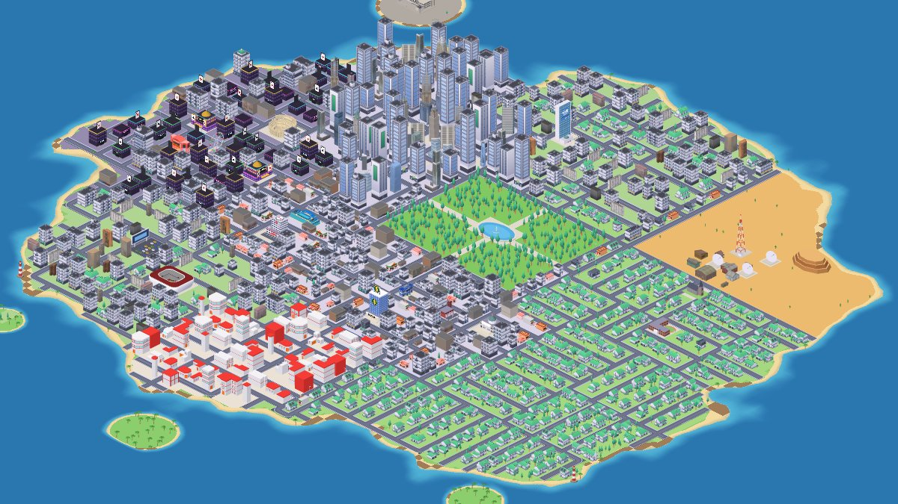
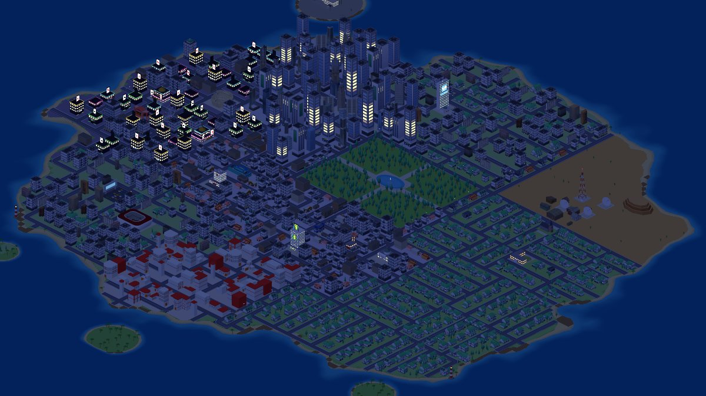
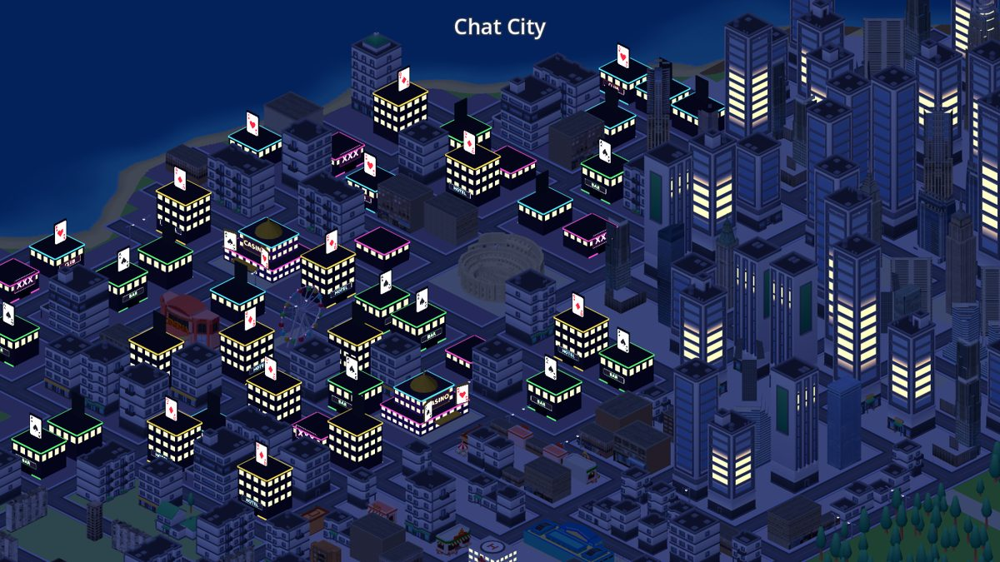
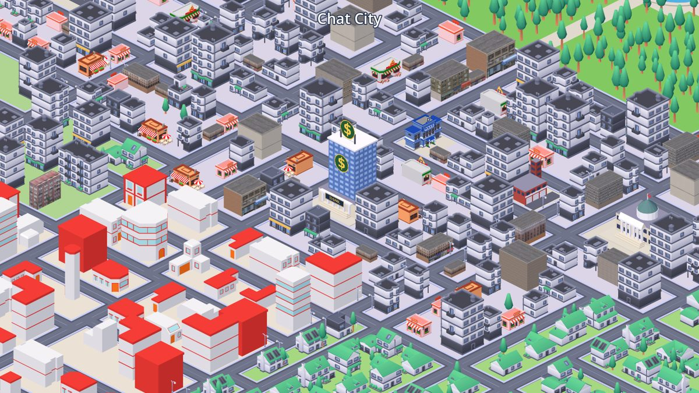
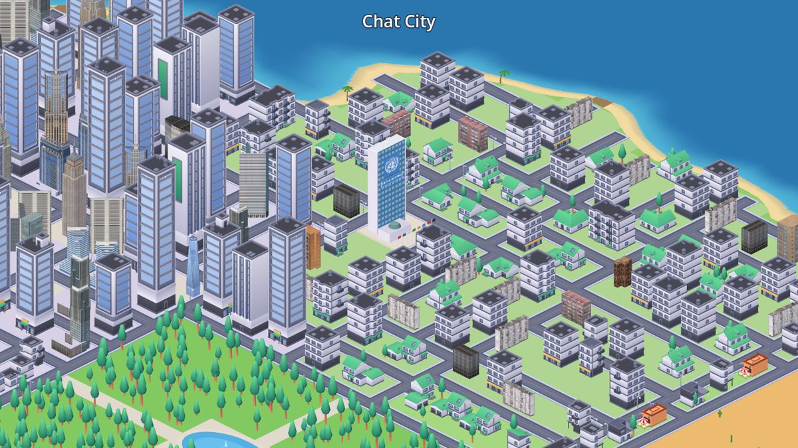
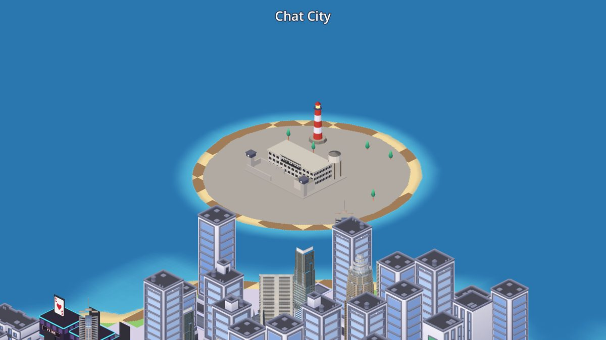
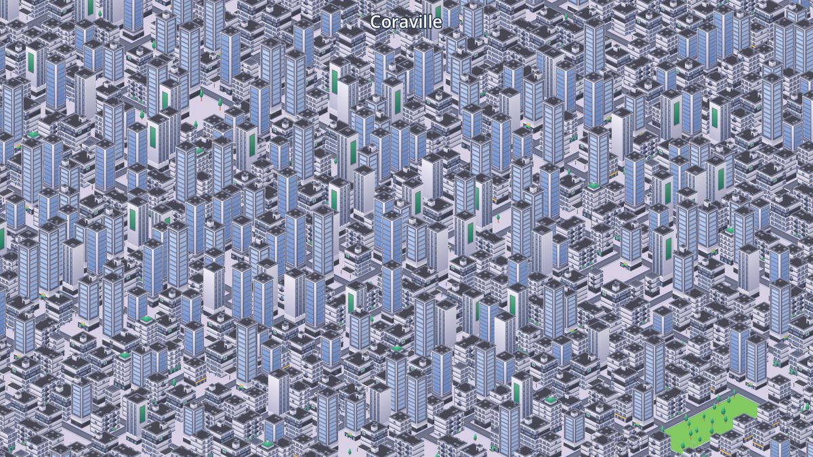
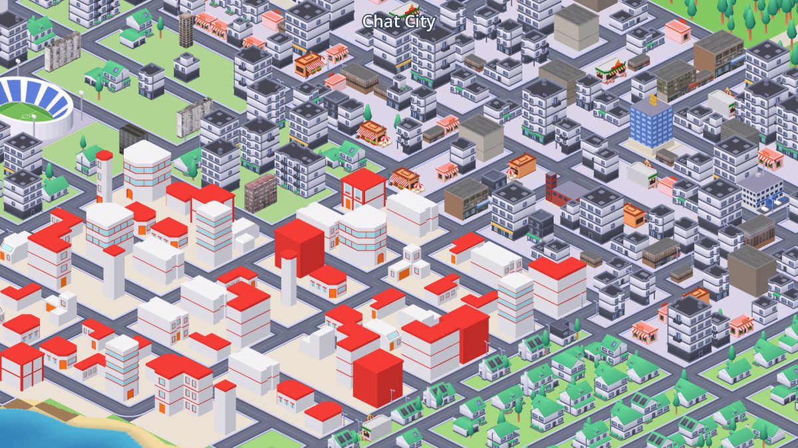
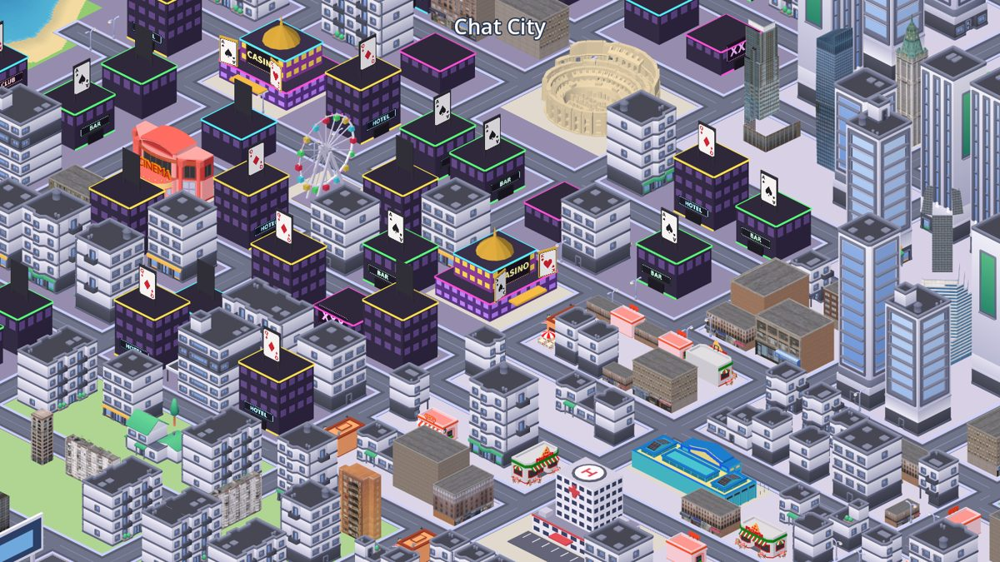
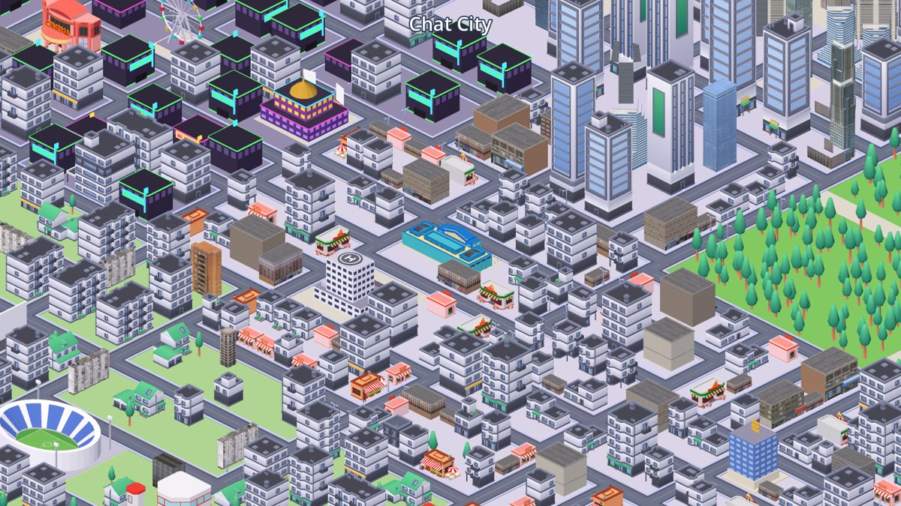
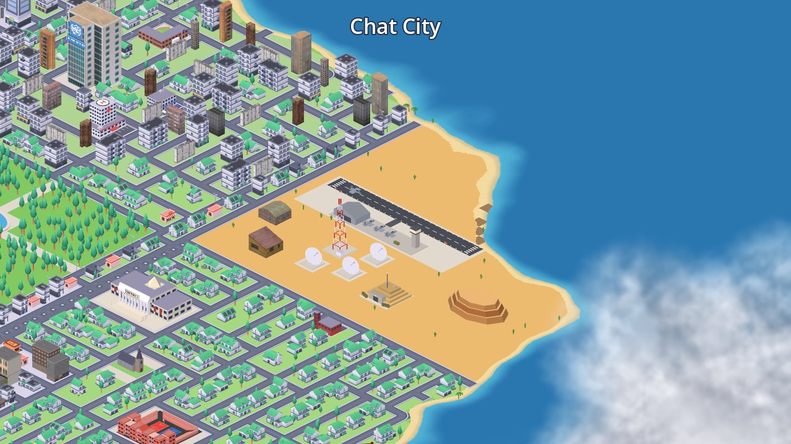
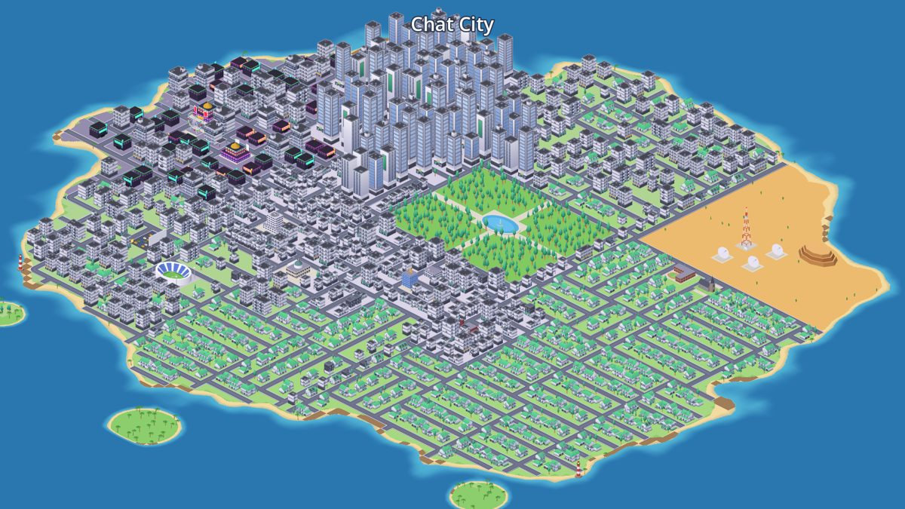

## Controls

| Action | Mouse / keyboard | Touch / trackpad |
| --- | --- | --- |
| Navigate | drag with any mouse button, `WASD` / arrows | one finger drag, two-finger scroll |
| Zoom | mouse wheel (zooms at the cursor), `Q` / `E`, `-` / `+` | pinch |

## Test it with Docker

Requirements: Docker Desktop (Windows / macOS) or Docker Engine (Linux).
The images use **Godot 4.6.3**. Set `GODOT_VERSION` in `docker-compose.yml` to use another version.

### Play it in your browser

```
docker compose up --build web
```

Then open **http://localhost:8080**. This is the fast multi-threaded build, rendered by your GPU through WebGL 2.

* **From a phone or another PC on your network:** open `http://<your-pc-ip>:8080/lite/`. Browsers only allow the multi-threaded build on `localhost` or HTTPS, so `/lite/` is a single-threaded build. It is slower, but works everywhere.
* **First build:** it downloads Godot (~60 MB) and its export templates (~1.25 GB). Docker caches both, so later builds only re-export the project (about 1 minute).
* **After you change the code:** run the same command again.
* **Stop:** `Ctrl+C`, or `docker compose down`.

### Run the automated checks

```
docker compose run --build --rm tests
```

This runs the generation test, the chunk benchmark and a top-down map. It also takes 10 screenshots of key places (downtown, hospital, school, stadium, city hall, suburbs, industry) without needing a GPU.
Everything is written to `./docker-out/` (`map.png`, `shot_0.png` ... `shot_9.png`). The screenshots use software rendering, so this step takes a few minutes.

### Files

```
docker-compose.yml     services "web" (port 8080) and "tests"
docker/Dockerfile      stages: godot -> project (import) -> tests | templates -> export -> web (nginx)
docker/nginx.conf      adds the COOP/COEP headers needed by the threaded web build
docker/run-tests.sh    what the tests container runs
export_presets.cfg     "Web" (threads) and "Web Lite" (no threads) presets
```

## The island

Chat City is one city on a 128×128-cell island, about 850 buildings. Every district has a fixed place, so the map reads like a designed city.
On screen north-west is up.

| Where (on screen) | District | What you find |
| --- | --- | --- |
| top | **Downtown** | the only skyscraper district: Kenney towers outside, photo towers in the middle, and 7 landmarks (Empire State, Chrysler, One WTC, Woolworth, New York Times, MetLife, Flatiron) |
| top-left (west coast) | **Little Las Vegas** | 2 casino palaces with golden domes, neon clubs, a ferris wheel, a cinema, cartoon diners |
| centre | **Central park** | a large wood with a lake, a fountain and two crossing paths, ring roads all around |
| right | **Desert** | a telecom tower, 3 satellite dishes, a mesa, an outpost (barns, ranch houses, trailers, water tank), cacti |
| below the park | **Civic center** | city hall, bank, police, fire station, hospital (one of each) |
| left of the park | **Shopping streets** | the shopping center, New York street buildings, cartoon shops |
| right / bottom | **Residential** | houses with gardens; the school and the church |
| bottom (south coast) | **Colourful quarter** | white and red low-rise town, a few towers |
| left | **Sports corner** | the stadium and the drive-in cinema |
| coast | **Beaches and rocky shores** | 2 lighthouses and 3 palm islets |
| top-left, at sea | **Prison island** | a rocky Alcatraz-like island facing downtown: cellhouse, water tower, guard towers, lighthouse |
| above the park | **United Nations** | glass slab with the emblem, assembly hall and flags |

How it is built (`scripts/generation/`, one seed in `CityConfig.seed`, the same city on every device):

1. **`island_shaper.gd`**: an elliptical island with a little noise, sandy and rocky shores, and the islets.
2. **`district_planner.gd`**: the district layout (anchors and the park and desert areas, in island units).
3. **`road_planner.gd`**: recursive splitting (BSP) into blocks. The borders of the park and the desert are cut first, so they become ring roads. The first splits are avenues with street lights.
4. **`lot_planner.gd`**: blocks cut into lots, every building facing its street.
5. **`service_planner.gd`**: every public building once (casinos twice), in the block closest to its district, never two in the same spot. The 7 landmark towers are each placed once downtown.
6. **`landmark_planner.gd`**: the park lake and paths, the desert station, mesa and outpost, the lighthouses.

Which family of models a building uses (Kenney, photo towers, New York, cartoon shops, the quarter...) is decided per district in `scripts/world/model_pools.gd`.

To move a district or change its size, edit `ANCHORS`, `PARK_AREA` or `DESERT_AREA` in `district_planner.gd`.

## Day and night

The city runs an automatic day and night cycle (`CityConfig.day_cycle_seconds`, 4 minutes by default; `scripts/world/day_night.gd`).
At night:

* Kenney windows glow. An emission mask is built from their colour palette, so only the glass lights up.
* The windows of the procedural buildings glow too.
* Street lamps get bulbs.
* Signs shine, and the neon stays bright.

No real lights are added, so night costs the same as day, on phones too.
The New York and photo towers have no window mask, so they simply get dark.

## Signs

All signs are on one 1024×1024 texture, `textures/signs.png`:

* the U.N. emblem and the "UNITED NATIONS" name
* the gold "$" coin and the "BANK" plate
* neon "XXX", "CASINO", "HOTEL", "BAR" and "CLUB"
* four playing cards
* the "PENITENTIARY" plate

`tools/make_sign_atlas.py` draws it with the free DejaVu fonts; the emblem source is `tools/sign_sources/un_emblem.png`.
Signs are flat panels placed with `MeshKit.panel()`, which always faces the reader, so text is never mirrored.
Landmarks also face a street on a side the camera sees, so their signs are in view.

## Memory and performance

* **Compact data**: the whole city is packed byte and int arrays, a few MB in total.
* **Ground and sea**: one plane and two small textures (one texel per cell) instead of thousands of tiles. The coastline comes from a shader.
* **Streaming chunks** (32×32 cells): only chunks inside the camera view are built.
  * **Far detail**: one coloured box per building, 1 draw call per chunk.
  * **Near detail**: the real Kenney models, roads, trees and lights. Each model is one `MultiMesh` per chunk, about 16 draw calls per chunk.
  * On desktop the whole island stays in near detail. Phones switch to boxes when zoomed far out.
* **Worker threads**: chunk contents are computed on `WorkerThreadPool`. The main thread only creates nodes, a few per frame.
* **LRU eviction** keeps at most `max_near_chunks` and `max_far_chunks` in memory.
* **Mobile profile** (`CityConfig.create()`): fewer detailed chunks, fewer threads, fewer model variants.
* **Curated models**: textures are reduced to 256 or 512 px and only the colour map is kept. Packs are opened once while loading, then freed.
* **Browser download**: about 16 MB of game data plus the 37 MB engine (cached by the browser).

## Models (FREEMODELS)

`FREEMODELS/` contains the GLB versions of the Kenney City Kits (CC0): Roads, Commercial, Suburban and Industrial.
`ModelCatalog` scans the folder recursively and sorts models by file name:

* skyscrapers, commercial buildings, houses, industrial buildings and props
* trees, street lights, and the 5 road tiles (straight, bend, T, crossroad, end)

The road tiles are rotated automatically from their measured connection masks.
Everything the kits do not have is modelled in code (`scripts/procedural/`) in the same style:

* **Public buildings**: hospital (red H on the helipad), school, fire station, church, city hall, the bank with its "$" signs, the United Nations, the prison. Fallbacks are kept for the police station and the stadium.
* **Las Vegas**: casinos, neon clubs, ferris wheel, drive-in. The neon is drawn unshaded, with no post effect.
* **Desert and coast**: telecom tower, satellite dishes, mesa, cactus, lighthouse, palm tree, park lake.

> If your local `FREEMODELS` also contains the `FBX format` / `OBJ format` / `Previews` folders from the zips,
> put an empty `.gdignore` file in each of them. Godot then skips importing duplicates (faster import, smaller export).

### Extra model packs (curated)

The packs you added are kept untouched in `FREEMODELS/_incoming/`. Its `.gdignore` stops Godot from importing them, and Docker skips them too.
`tools/curate_models.gd` builds `FREEMODELS/curated/` from them, following `tools/curate_spec.json`:

* **What is kept**: only complete buildings. Wall slabs, ground pieces and props are dropped, and the bad automatic picks are listed in `exclude`.
* **Scale**: every building is put at Kenney scale (1 unit = 1 road tile), centred, standing on the ground, front towards +Z.
* **Textures**: reduced, colour map only.
* **Output**: one `.glb` per pack plus a `.models.json` list (building name to category). The game reads these lists.

| Curated pack | From | Category | Used for |
| --- | --- | --- | --- |
| `ny_buildings` | New York buildings | LANDMARK, TOWER_PHOTO, NY_MIDRISE | 7 landmarks, glass towers, brick buildings |
| `ny_street` | buildings | NY_STREET | shop and office buildings in commercial streets |
| `towers_a`, `towers_b` | city pack 7 / 8 | TOWER_PHOTO | 16 towers for the middle of downtown |
| `panel_block` | 12-storey panel block | PANEL | some apartment lots |
| `quarter` | 100 low-poly buildings | QUARTER_LOW / MID / TALL | the colourful quarter (87 buildings) |
| `business` | low-poly business pack | BIZ_SHOP, CINEMA, MALL | diners and shops, the cinema, the shopping center |
| `outpost` | low-poly buildings | OUTPOST | the desert outpost |
| `police` | low-poly police station | POLICE | the police station |
| `stadium` | low-poly stadium (+ its pitch) | STADIUM | the stadium |
| `coliseum` | coliseum (tinted stone colour) | COLISEUM | the coliseum in Las Vegas |

Not used:

* **Kit parts, not whole buildings**: buildings pack, European asset pack, European facades, `building.glb`.
* **Duplicate**: the school (the procedural school is used).
* **Licence not confirmed**: Half-Life 2 buildings.

**Rebuild after changing the spec** (needs a display, or `xvfb-run` on Linux):

```
godot --rendering-driver opengl3 --script res://tools/curate_models.gd
godot --rendering-driver opengl3 --script res://tools/model_sheet.gd -- FREEMODELS/curated/quarter.glb sheet.png
```

The second command renders a numbered contact sheet of a pack, to choose what to keep.

## Project structure

```
project.godot
scenes/main.tscn                  root scene (only the Main script)
shaders/ground.gdshader           island + sea colouring
scripts/
  core/       main.gd (bootstrap, loading), city_config.gd (all settings), city_types.gd (enums, helpers)
  data/       city_data.gd        packed city layers + buildings + chunk index
  generation/ city_generator.gd   pipeline: island_shaper, district_planner, road_planner,
                                  lot_planner, service_planner, landmark_planner
  assets/     model_catalog.gd (scan + classify + curated lists), model_library.gd (load, merge, mesh ids),
              night_windows.gd (window glow of the Kenney kits)
  procedural/ mesh_kit.gd (low-poly builder), sign_atlas.gd (signs + night materials),
              service_meshes.gd, civic_meshes.gd (bank, U.N., prison), landmark_meshes.gd,
              entertainment_meshes.gd (Las Vegas), nature_meshes.gd (desert, coast)
  world/      chunk_streamer.gd (LOD + streaming), building_placer.gd, model_pools.gd, day_night.gd,
              ground_placer.gd, instance_batch.gd, ground_layer.gd
  camera/     iso_camera.gd (ortho iso camera), camera_input.gd (mouse/touch/keys)
  ui/         loading_overlay.gd
tests/        headless checks and the screenshot runner
tools/        curate_models.gd + curate_spec.json (model packs), model_sheet.gd (contact sheets),
              make_sign_atlas.py (signs texture)
textures/     signs.png
```

## Tuning

* **General settings** (`scripts/core/city_config.gd`): `city_name`, `seed`, `map_size`, island shape, LOD threshold, memory budgets.
* **District layout**: `scripts/generation/district_planner.gd`.
* **Public buildings** (which ones, how many, in which district): `scripts/generation/service_planner.gd` (`SPECS`).

## Tests and tools

```
godot --headless --import                                         # first import of the models
godot --headless --script res://tests/test_generation.gd          # generation smoke test
godot --headless --script res://tests/debug_map.gd -- map.png     # top-down zoning map
godot --headless --script res://tests/bench_chunks.gd             # chunk build cost / draw calls
godot -- --capture <dir>                                          # screenshots of key places
```
