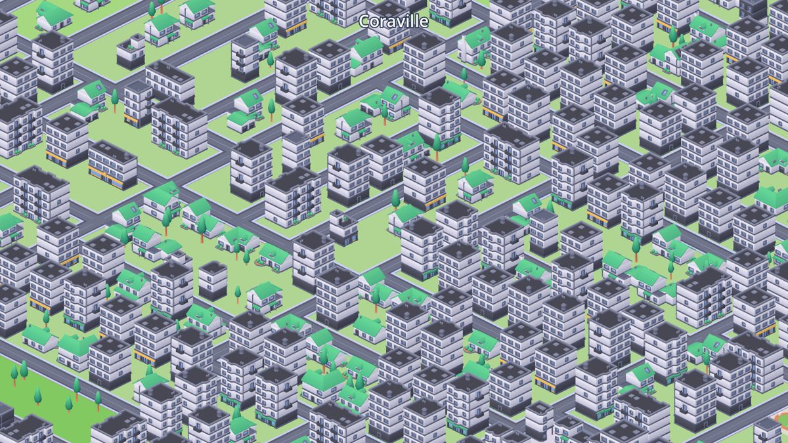
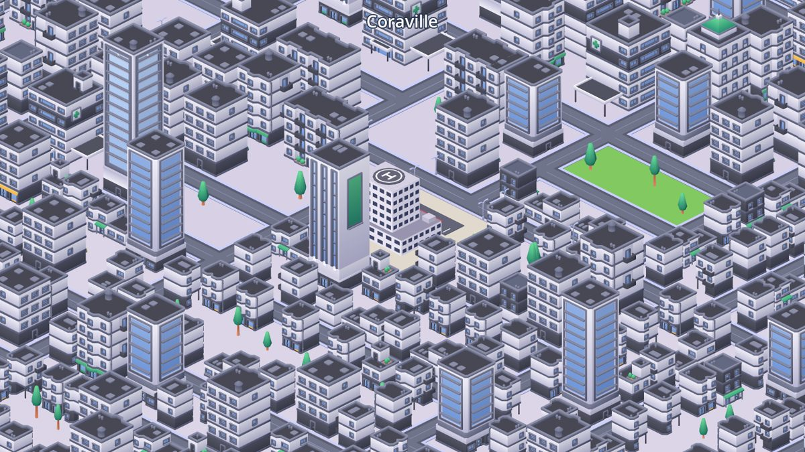

# Isometric Island City (Godot 4.3)

A very large procedural city on an island, in an isometric view inspired by
Voxurbis. There is no gameplay: you can only **navigate** and **zoom**.
It runs on desktop and mobile (GL Compatibility renderer).





## Controls

| Action | Mouse / keyboard | Touch / trackpad |
| --- | --- | --- |
| Navigate | drag with any mouse button, `WASD` / arrows | one finger drag, two-finger scroll |
| Zoom | mouse wheel (zooms at the cursor), `Q` / `E`, `-` / `+` | pinch |

## What gets generated

The city is generated from one seed (`CityConfig.seed`), so it is the same on every device.

1. **Island**: a noisy falloff shape with beaches, shallow water and forests. Only the largest landmass gets a city.
2. **Districts**: a downtown near the middle of the island, 4 secondary town centers and a port with an industrial area on the coast. A density field decides how urban each place is.
3. **Roads**: the island is split recursively (BSP). The first splits are avenues crossing the whole island (with street lights); deeper splits are local streets. Short water crossings become bridges. Block size depends on density, so downtown blocks are small and suburban blocks are long.
4. **Zoning**: downtown (towers), commercial, apartments (with some older row houses), suburbs (houses, shops on the avenues), industry, a central park and some neighbourhood parks. Low-density land stays countryside.
5. **Lots**: each block is cut into lots. Every building faces the street it touches; inner lots become gardens, plazas or industrial yards.
6. **Public services**: placed the way a real city would place them:
   * 1 city hall (on a plaza at the edge of downtown) and 1 stadium.
   * hospitals at least about 1.5 km apart, plus fire stations, police stations and schools, each with its own minimum spacing.
   * any two services keep a gap, so they never cluster in one place.

A 640×640-cell island has about 27,000 lots, 10 hospitals, 23 fire stations, 21 police stations and 42 schools.

## Memory and performance

* **Compact data**: the whole city is packed byte and int arrays, a few MB in total.
* **Ground and sea**: one plane and two small textures (one texel per cell) instead of thousands of tiles. The coastline comes from a shader.
* **Streaming chunks** (48×48 cells): only chunks inside the camera view are built.
  * **Far detail**: one coloured box per building, 1 draw call per chunk.
  * **Near detail**: the real Kenney models, roads, trees and lights. Each model is one `MultiMesh` per chunk, about 27 draw calls per chunk.
* **Worker threads**: chunk contents are computed on `WorkerThreadPool`. The main thread only creates nodes, a few per frame.
* **LRU eviction** keeps at most `max_near_chunks` and `max_far_chunks` in memory.
* **Mobile profile** (`CityConfig.create()`): smaller island, fewer detailed chunks, fewer threads, fewer model variants.

## Models (FREEMODELS)

`FREEMODELS/` contains the GLB versions of the Kenney City Kits (CC0): Roads, Commercial, Suburban and Industrial.
`ModelCatalog` scans the folder recursively and sorts models by file name:

* skyscrapers, commercial buildings, houses, industrial buildings and props
* trees, street lights, and the 5 road tiles (straight, bend, T, crossroad, end)

The road tiles are rotated automatically from their measured connection masks.
Hospitals, schools, fire and police stations, the city hall, the stadium and the park fountain are not in the kits, so they are modelled in code (`scripts/procedural/`) in the same style.

> If your local `FREEMODELS` also contains the `FBX format` / `OBJ format` / `Previews` folders from the zips,
> put an empty `.gdignore` file in each of them. Godot then skips importing duplicates (faster import, smaller export).

## Project structure

```
project.godot
scenes/main.tscn                  root scene (only the Main script)
shaders/ground.gdshader           island + sea colouring
scripts/
  core/       main.gd (bootstrap, loading), city_config.gd (all settings), city_types.gd (enums, helpers)
  data/       city_data.gd        packed city layers + buildings + chunk index
  generation/ city_generator.gd   pipeline: island_shaper, district_planner, road_planner,
                                  lot_planner, service_planner
  assets/     model_catalog.gd (scan + classify), model_library.gd (load, merge, mesh ids)
  procedural/ mesh_kit.gd (low-poly builder), service_meshes.gd, landmark_meshes.gd
  world/      chunk_streamer.gd (LOD + streaming), building_placer.gd, ground_placer.gd,
              instance_batch.gd, ground_layer.gd
  camera/     iso_camera.gd (ortho iso camera), camera_input.gd (mouse/touch/keys)
  ui/         loading_overlay.gd
tests/        headless checks and the screenshot runner
```

## Tuning

Everything is in `scripts/core/city_config.gd`: `seed`, `map_size`, island shape, number of town centers, LOD threshold, memory budgets.
Service spacing is in `scripts/generation/service_planner.gd` (`SPECS`).

## Tests and tools

```
godot --headless --import                                         # first import of the models
godot --headless --script res://tests/test_generation.gd          # generation smoke test
godot --headless --script res://tests/debug_map.gd -- map.png     # top-down zoning map
godot --headless --script res://tests/bench_chunks.gd             # chunk build cost / draw calls
godot -- --capture <dir>                                          # screenshots of key places
```
