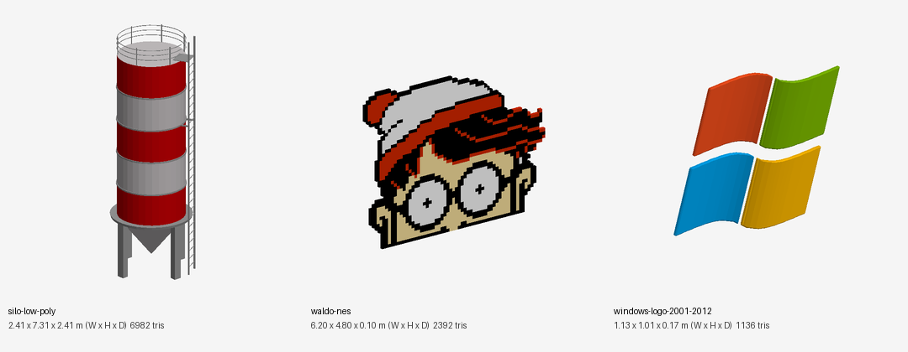
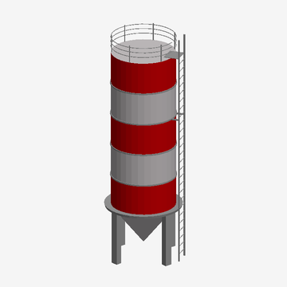

# New models catalog

Documentation only: these GLBs are not copied into the project and nothing in the game uses them yet.

Source files live in the Downloads folder. Sizes are the raw authored bounding box (glTF, Y up, 1 unit = 1 m assumed); W x H x D = X x Y x Z.

Machine-readable list: [`catalog.json`](catalog.json).

| Preview | ID | Category | Name | W x H x D (m) | Tris | Mat. / Tex. | Author | License |
|---|---|---|---|---|---|---|---|---|
|  | `silo-low-poly` | Props / industrial | Low Poly Silo | 2.41 x 7.31 x 2.41 | 6982 | 3 / 0 | CevoCreative | CC-BY-4.0 |
|  | `waldo-nes` | Props / sprite | NES - Wheres Waldo - Waldo | 6.2 x 4.8 x 0.1 | 2392 | 1 / 1 | Carl.Kirsch | CC-BY-4.0 |
|  | `windows-logo-2001-2012` | Props / logo | Windows Logo (2001-2012) in 3D | 1.13 x 1.01 x 0.17 | 1136 | 4 / 0 | ZoeError Remakes | CC-BY-4.0 |

## Notes and credits

- **silo-low-poly** - Red/grey striped grain silo with ladder, railing and legs. Origin on the ground at the footprint centre, Y up. 3 materials, no textures. Source file `low_poly_silo.glb`. <https://sketchfab.com/3d-models/low-poly-silo-a7814afddf2b4736a65e551a4e8ff1ed>
- **waldo-nes** - Pixel-art Waldo head extruded to a 0.1 m slab (palette texture). Flat sign-like prop, front face +Z, origin at bottom centre (x -3.1..3.1, y 0..4.8). Needs scale for use. Source file `nes_-_wheres_waldo_-waldo.glb`. <https://sketchfab.com/3d-models/nes-wheres-waldo-waldo-a8dab891322a49058a2c114cce793a7a>
- **windows-logo-2001-2012** - Four coloured curved panes (red, green, blue, yellow); 4 separate meshes, 4 plain-colour materials. Origin at the centre of the logo, not on the ground; tiny (about 1 m) so scale up. Source file `windows_logo_2001-2012_in_3d.glb`. <https://sketchfab.com/3d-models/windows-logo-2001-2012-in-3d-3debae58dd9f49baaa2bc4bb1dc24aeb>

## Adding more models

Give the GLB files and they are appended here (new rows, thumbnail, JSON entry). Nothing outside `docs/new_models/` is touched.

## Other catalogs in this folder

- [beach/CATALOG.md](beach/CATALOG.md): deck chair, 2 umbrellas, beach ball
- [military/CATALOG.md](military/CATALOG.md): 16 tanks, 12 APC/IFV, 13 radars (Strike Fighters packs are CC-BY-NC)
- [city_street_pack/CATALOG.md](city_street_pack/CATALOG.md): the stylized city street scene split into 70 items
