# Models by theme (all Downloads GLBs)

One sheet per theme; each cell is a render of the whole file (packs show every building laid out as authored). Heavy models are marked **HEAVY**. Numbers: triangles / texture VRAM / file size. Full table: [ALL_MODELS.md](ALL_MODELS.md).

## 01 Building packs: Europe, New York, mixed

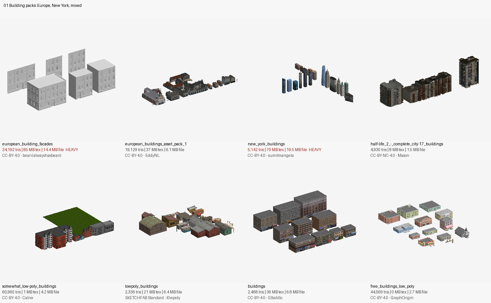

## 02 Building packs: city and low-poly sets (page 1/2)

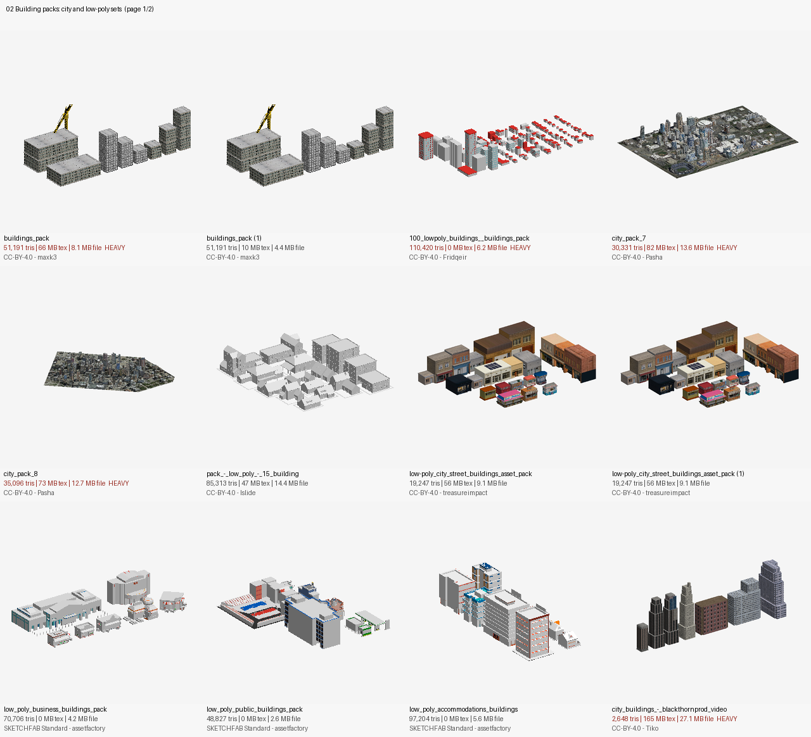

## 02 Building packs: city and low-poly sets (page 2/2)

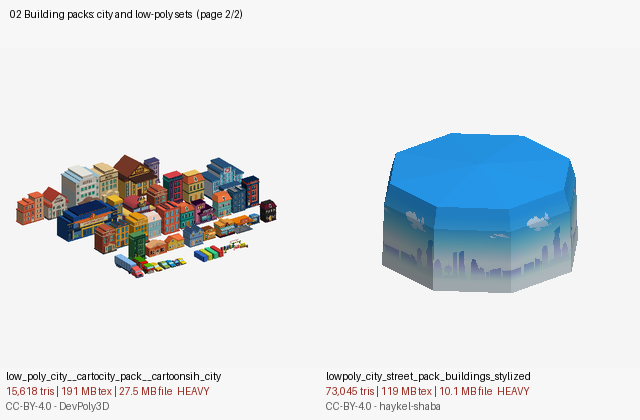

## 03 Single buildings and landmarks (page 1/2)

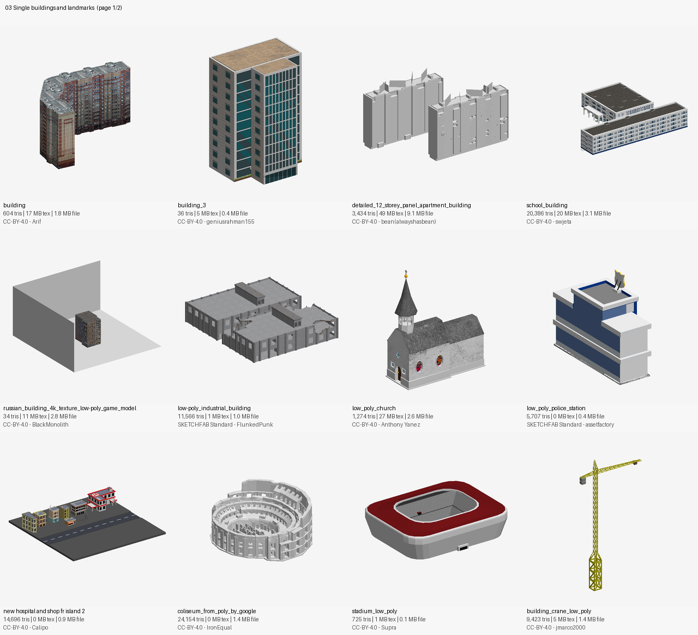

## 03 Single buildings and landmarks (page 2/2)

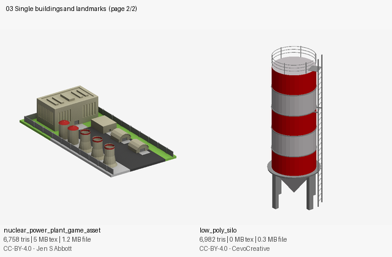

## 04 Restaurants, shops and signs

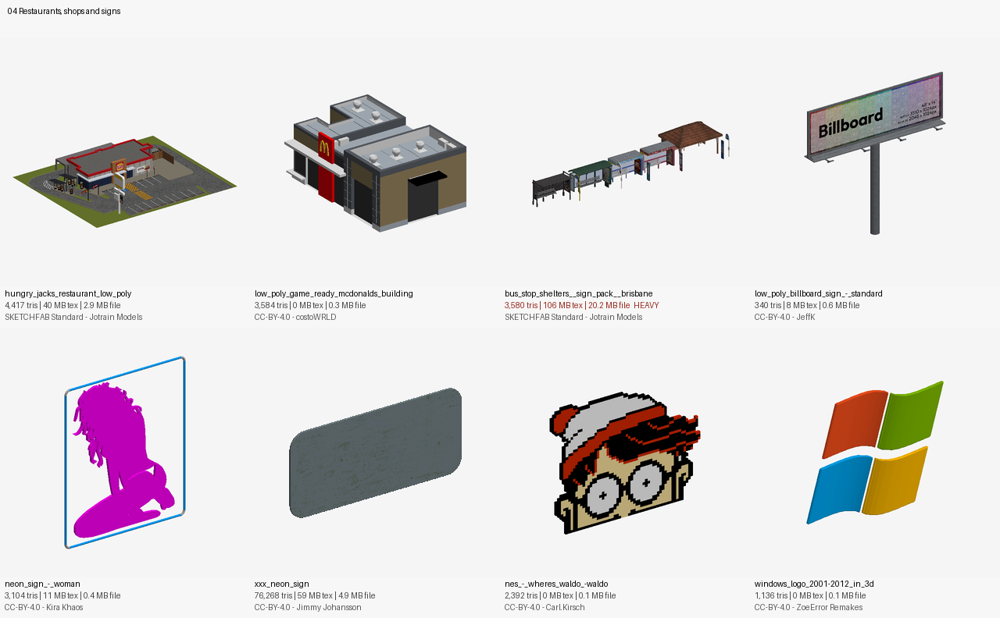

## 05 Night skylines

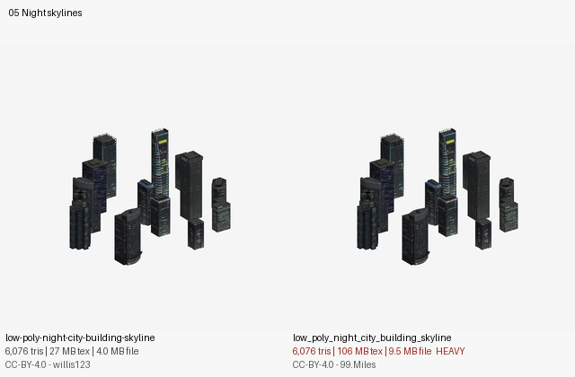

## 06 Bridges, roads and piers

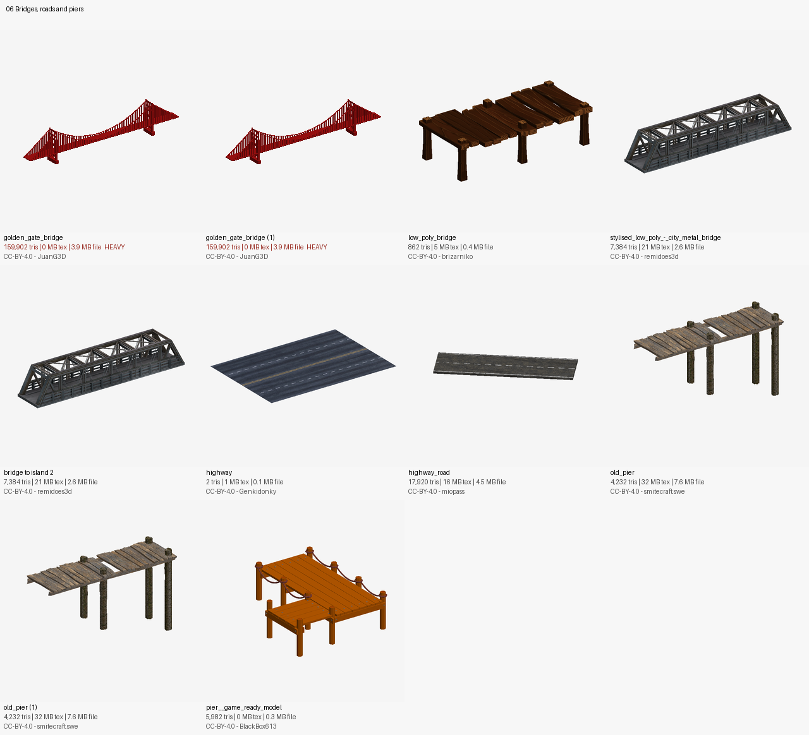

## 07 Civil vehicles and emergency

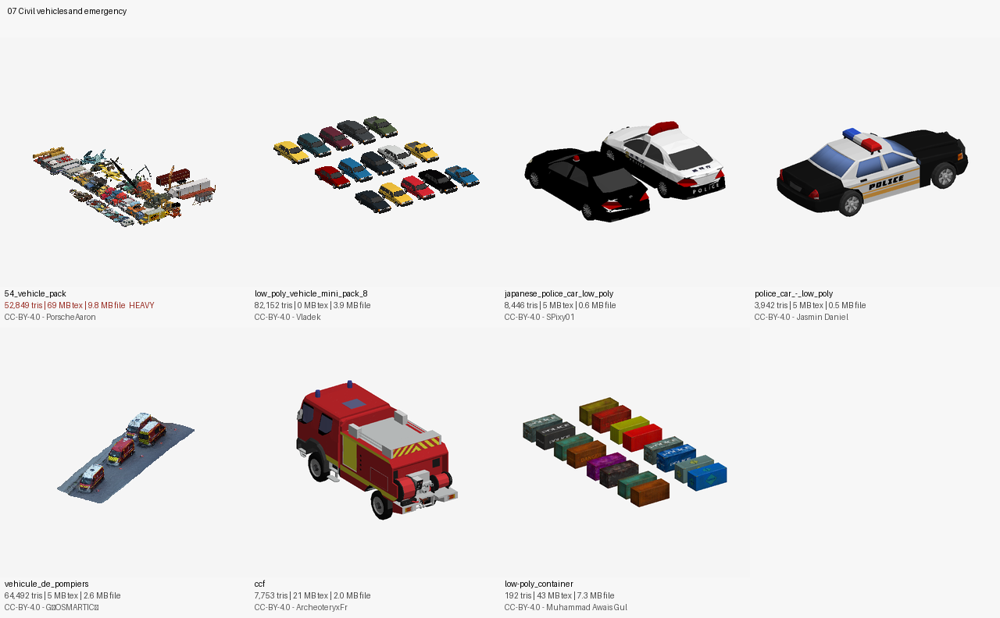

## 08 Military land vehicles

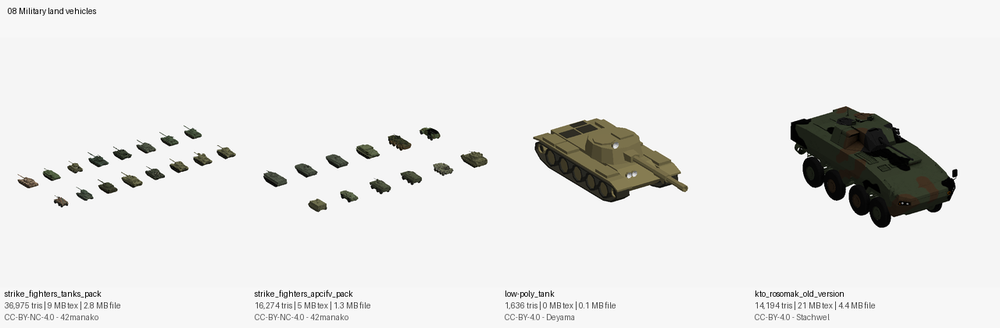

## 09 Radars and air defence

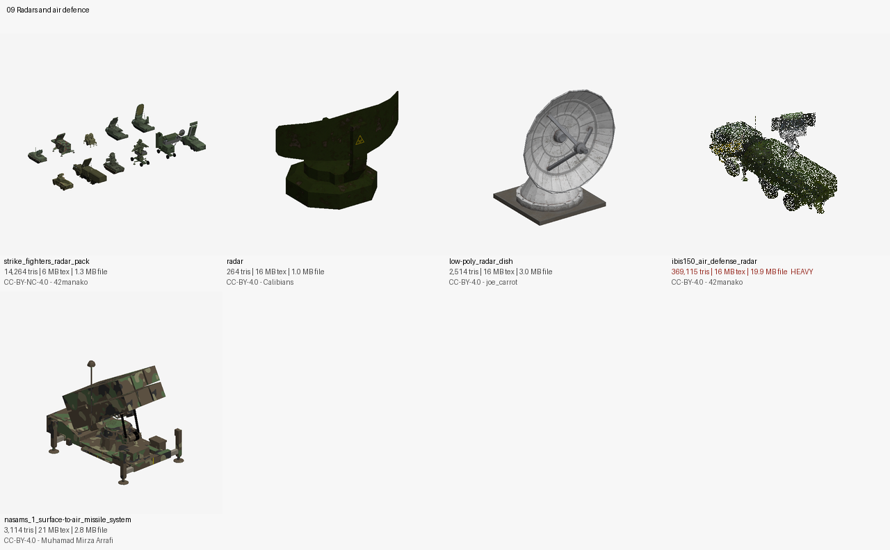

## 10 Aircraft and sky

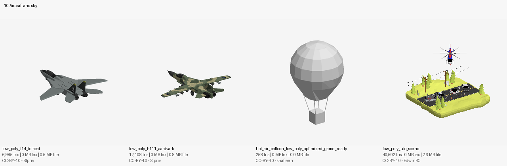

## 11 Boats and ships

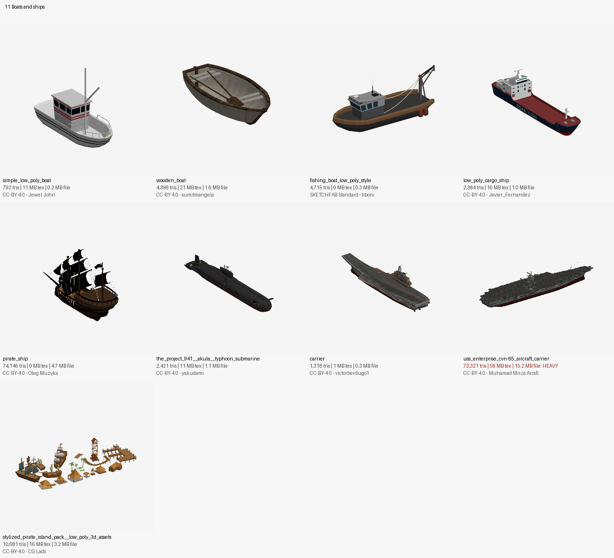

## 12 Beach, camping and tents

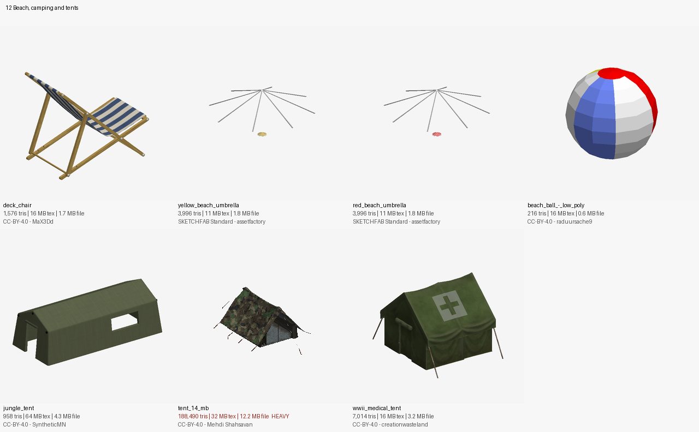

