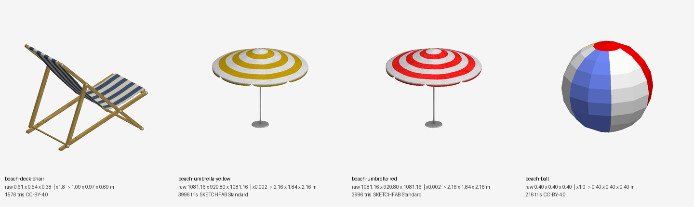
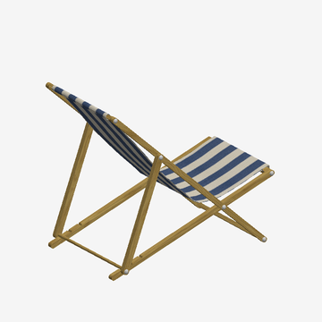
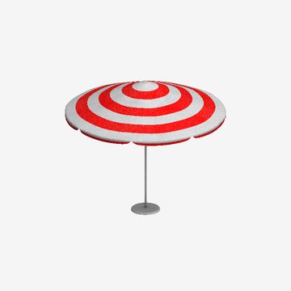
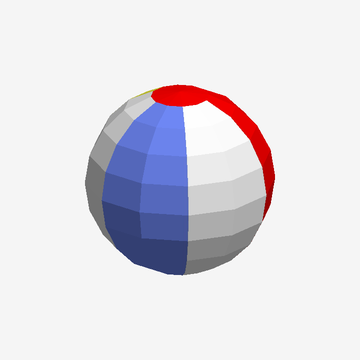

# Beach catalog

Documentation only: these GLBs are not copied into the project and nothing in the game uses them yet. Source files are in the Downloads folder.

Machine-readable list: [`catalog.json`](catalog.json). Raw size = bounding box as authored (Y up); *Scale* is the suggested factor to reach real-world metres.

| Preview | ID | Category | Name | Raw W x H x D | Scale | Real size (m) | Tris | Anim | Author | License |
|---|---|---|---|---|---|---|---|---|---|---|
|  | `beach-deck-chair` | Furniture | Deck chair | 0.61 x 0.54 x 0.38 | x1.8 | 1.09 x 0.97 x 0.69 | 1576 | no | MaX3Dd | CC-BY-4.0 |
|  | `beach-umbrella-yellow` | Shade | Yellow beach umbrella | 1081.16 x 920.8 x 1081.16 | x0.002 | 2.16 x 1.84 x 2.16 | 3996 | yes | assetfactory | SKETCHFAB Standard |
|  | `beach-umbrella-red` | Shade | Red beach umbrella | 1081.16 x 920.8 x 1081.16 | x0.002 | 2.16 x 1.84 x 2.16 | 3996 | yes | assetfactory | SKETCHFAB Standard |
|  | `beach-ball` | Toy | Beach ball (low poly) | 0.4 x 0.4 x 0.4 | x1.0 | 0.4 x 0.4 x 0.4 | 216 | no | raduursache9 | CC-BY-4.0 |

## Notes and credits

- **beach-deck-chair** - Striped navy/cream folding deck chair, wooden frame. Raw size is about 0.6 m wide, so it is small for a real chair (about 1.1 m long): scale about x1.8. Two meshes, one texture material. Source file `deck_chair.glb`. <https://sketchfab.com/3d-models/deck-chair-38de6171cbeb41c5bdc49c07df76ede9>
- **beach-umbrella-yellow** - Yellow/white ringed parasol on a metal pole with base disc and 8 ribs. The file is skinned and animated (opening animation, 33 joints, 16 channels); the preview is the static rest shape. Raw units are not metres: about 1081 x 921 x 1081, so a real-size 2.2 m umbrella needs scale about 0.002. Pole is the lowest part (origin around mid-pole, not on the ground). Source file `yellow_beach_umbrella.glb`. <https://sketchfab.com/3d-models/yellow-beach-umbrella-8f86d785422c4c9dbe43d42da486098b>
- **beach-umbrella-red** - Same model as the yellow umbrella with a red/white texture. Skinned and animated; same scale note (about 0.002). Source file `red_beach_umbrella.glb`. <https://sketchfab.com/3d-models/red-beach-umbrella-86f58a6d1b434b11a4830c4c43d1f52d>
- **beach-ball** - Blue/white/red segmented ball, 216 triangles, 0.4 m diameter, centred on origin (needs to be lifted by 0.2 m to sit on the ground). Real size already. Source file `beach_ball_-_low_poly.glb`. <https://sketchfab.com/3d-models/beach-ball-low-poly-40949184dcbc4d5cba5f115b1c0dcf6f>

**License warning:** the two umbrellas are under the Sketchfab Standard license (not CC-BY), so check that it allows use in the game before shipping them.
