# City street pack catalog

Documentation only: the GLB is not copied into the project and nothing in the game uses it yet. Source file: `lowpoly_city_street_pack_buildings_stylized.glb` (Downloads folder, 10 MB).

**Credit:** LOWPOLY CITY STREET PACK BUILDINGS STYLIZED by haykel-shaba, CC-BY-4.0, <https://sketchfab.com/3d-models/lowpoly-city-street-pack-buildings-stylized-8e1ba8a437c4460eaaa643953eaf79d0>

This file is **one scene** of 167 top-level objects laid out in zones (neon skyline, music stage, court plaza, street row, futuristic district with rails, long elevated road, big purple blocks) plus a huge background sky sphere (ignored here). Objects are catalogued below by role; `source_nodes` in [`catalog.json`](catalog.json) names the nodes to extract.

Units: raw values are centimetre-like; sizes below are raw/100 (scene units, u). The stylised world is oversized: a van comes out about 9.7 u long, so a factor of about 0.45 gives real-world metres for vehicles and props. About 73,000 triangles in total.

## Neon downtown (night skyline) (15)

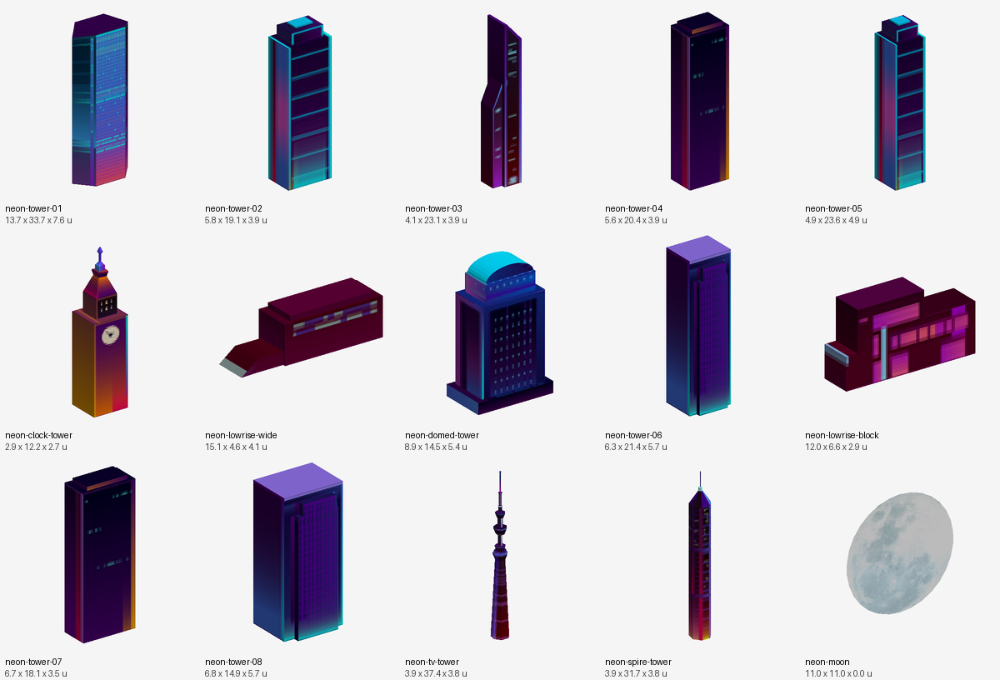

| Preview | ID | Name | W x H x D (u) | Tris | Notes |
|---|---|---|---|---|---|
| 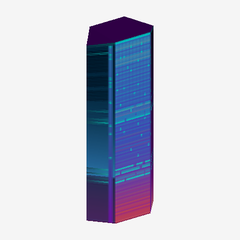 | `neon-tower-01` | Glass tower, blue gradient | 13.7 x 33.7 x 7.6 | 20 |  |
| 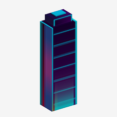 | `neon-tower-02` | Slim tower, cyan edges | 5.8 x 19.1 x 3.9 | 44 |  |
| 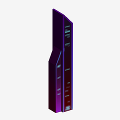 | `neon-tower-03` | Slanted slim tower | 4.1 x 23.1 x 3.9 | 36 |  |
| 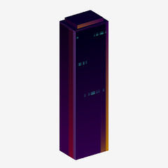 | `neon-tower-04` | Dark tower | 5.6 x 20.4 x 3.9 | 24 |  |
| 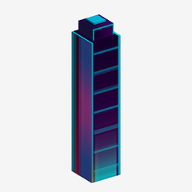 | `neon-tower-05` | Tower, cyan roof | 4.9 x 23.6 x 4.9 | 44 |  |
| 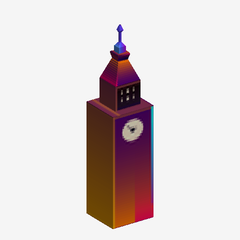 | `neon-clock-tower` | Clock tower (Big Ben style) | 2.9 x 12.2 x 2.7 | 124 |  |
| 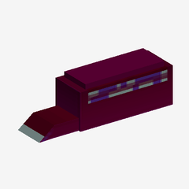 | `neon-lowrise-wide` | Wide low-rise with slanted ramp | 15.1 x 4.6 x 4.1 | 40 |  |
| 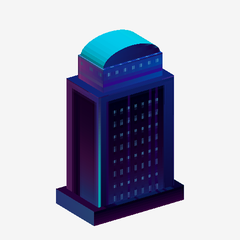 | `neon-domed-tower` | Domed tower | 8.9 x 14.5 x 5.4 | 106 |  |
| 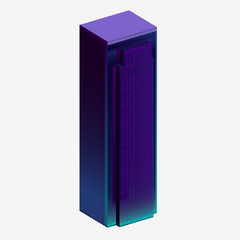 | `neon-tower-06` | Violet tower | 6.3 x 21.4 x 5.7 | 112 |  |
| 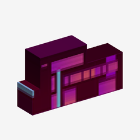 | `neon-lowrise-block` | Low neon block building | 12.0 x 6.6 x 2.9 | 48 |  |
| 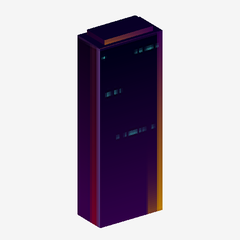 | `neon-tower-07` | Dark tower | 6.7 x 18.1 x 3.5 | 24 |  |
| 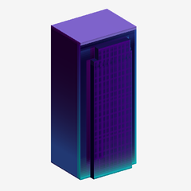 | `neon-tower-08` | Violet tower, wide | 6.8 x 14.9 x 5.7 | 112 |  |
| 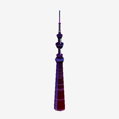 | `neon-tv-tower` | TV tower (Skytree style) | 3.9 x 37.4 x 3.8 | 412 |  |
| 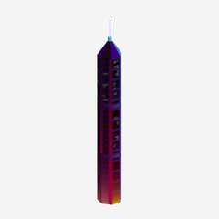 | `neon-spire-tower` | Spire tower | 3.9 x 31.7 x 3.8 | 80 |  |
| 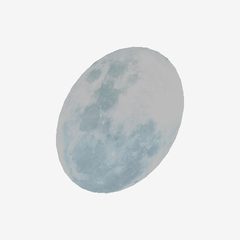 | `neon-moon` | Moon disc (flat, backdrop) | 11.0 x 11.0 x 0.0 | 30 | Flat, zero depth. |

## Street buildings (7)

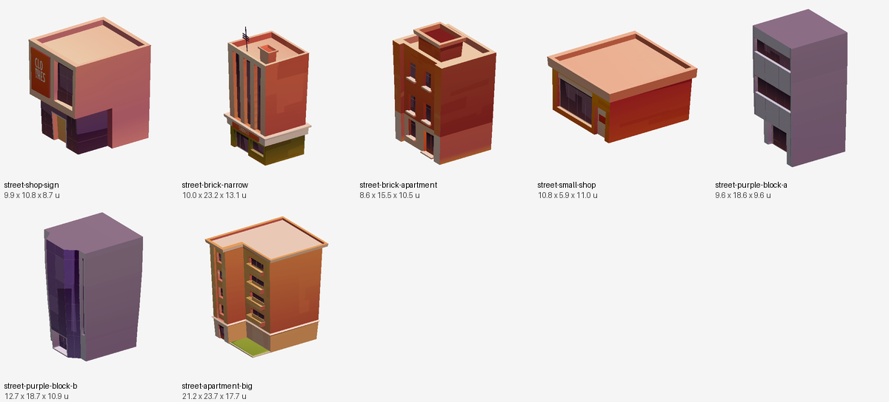

| Preview | ID | Name | W x H x D (u) | Tris | Notes |
|---|---|---|---|---|---|
| 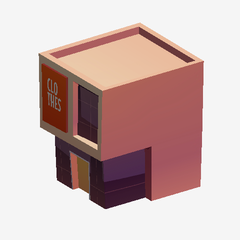 | `street-shop-sign` | Corner shop with sign (pink/orange) | 9.9 x 10.8 x 8.7 | 256 |  |
| 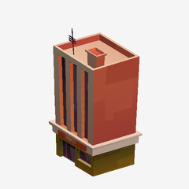 | `street-brick-narrow` | Tall narrow brick building | 10.0 x 23.2 x 13.1 | 3736 |  |
| 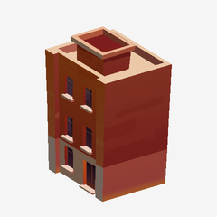 | `street-brick-apartment` | Brick apartment building | 8.6 x 15.5 x 10.5 | 544 |  |
| 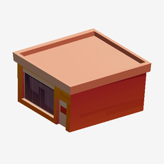 | `street-small-shop` | Small orange shop | 10.8 x 5.9 x 11.0 | 268 |  |
| 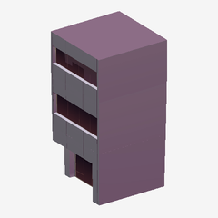 | `street-purple-block-a` | Purple block with balconies | 9.6 x 18.6 x 9.6 | 220 | Flat purple look. |
| 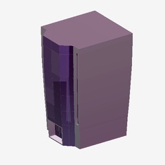 | `street-purple-block-b` | Purple tower block | 12.7 x 18.7 x 10.9 | 396 |  |
| 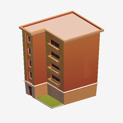 | `street-apartment-big` | Large brick apartment block with garden | 21.2 x 23.7 x 17.7 | 984 |  |

## Futuristic district (10)

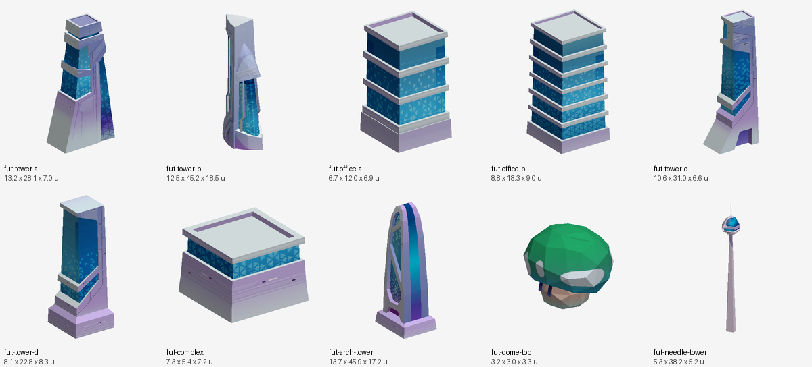

| Preview | ID | Name | W x H x D (u) | Tris | Notes |
|---|---|---|---|---|---|
| 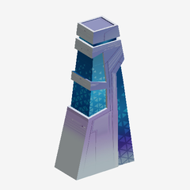 | `fut-tower-a` | Blue glass tower, stepped base | 13.2 x 28.1 x 7.0 | 182 |  |
| 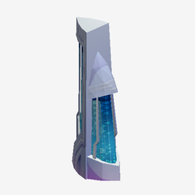 | `fut-tower-b` | Tall silver/blue tower | 12.5 x 45.2 x 18.5 | 231 |  |
| 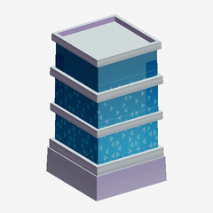 | `fut-office-a` | Blue glass office block (short) | 6.7 x 12.0 x 6.9 | 146 |  |
| 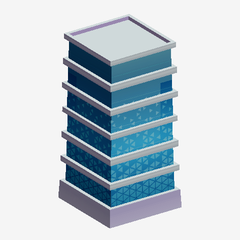 | `fut-office-b` | Blue glass office block (tall) | 8.8 x 18.3 x 9.0 | 218 |  |
| 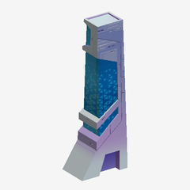 | `fut-tower-c` | Slender angular tower | 10.6 x 31.0 x 6.6 | 168 |  |
| 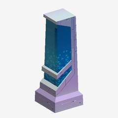 | `fut-tower-d` | Blue glass tower | 8.1 x 22.8 x 8.3 | 97 |  |
| 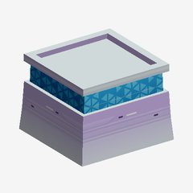 | `fut-complex` | Low glass complex | 7.3 x 5.4 x 7.2 | 76 |  |
| 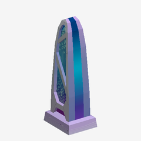 | `fut-arch-tower` | Arch-shaped tower (Gherkin style) | 13.7 x 45.9 x 17.2 | 273 |  |
| 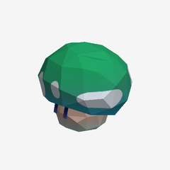 | `fut-dome-top` | Green dome roof piece | 3.2 x 3.0 x 3.3 | 252 | Rooftop dome. |
| 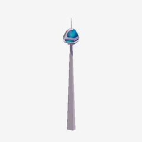 | `fut-needle-tower` | Needle tower with pod (CN Tower style) | 5.3 x 38.2 x 5.2 | 137 |  |

## Vehicles (5)

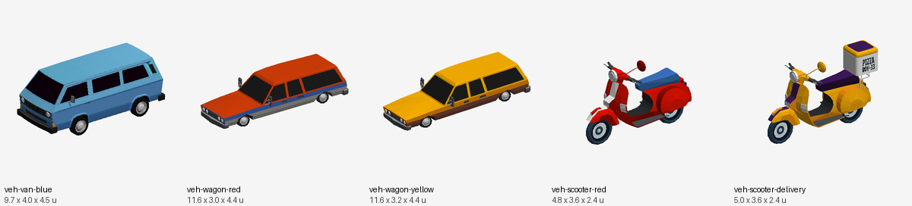

| Preview | ID | Name | W x H x D (u) | Tris | Notes |
|---|---|---|---|---|---|
| 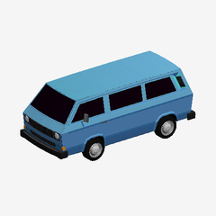 | `veh-van-blue` | Van, blue | 9.7 x 4.0 x 4.5 | 4930 |  |
| 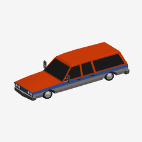 | `veh-wagon-red` | Station wagon, red | 11.6 x 3.0 x 4.4 | 4158 |  |
| 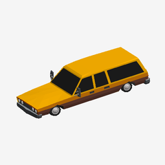 | `veh-wagon-yellow` | Station wagon, yellow (taxi) | 11.6 x 3.2 x 4.4 | 4158 |  |
| 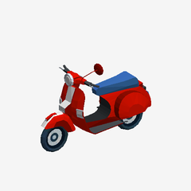 | `veh-scooter-red` | Scooter, red | 4.8 x 3.6 x 2.4 | 2617 |  |
| 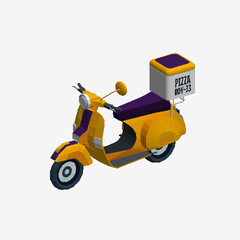 | `veh-scooter-delivery` | Delivery scooter, yellow (pizza box) | 5.0 x 3.6 x 2.4 | 3409 |  |

## Street furniture (15)

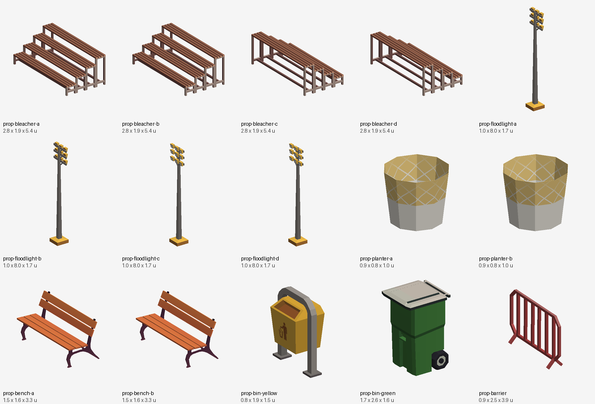

| Preview | ID | Name | W x H x D (u) | Tris | Notes |
|---|---|---|---|---|---|
|  | `prop-bleacher-a` | Bleacher / bench stand (A) | 2.8 x 1.9 x 5.4 | 624 |  |
| 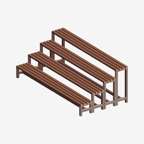 | `prop-bleacher-b` | Bleacher / bench stand (B) | 2.8 x 1.9 x 5.4 | 624 |  |
| 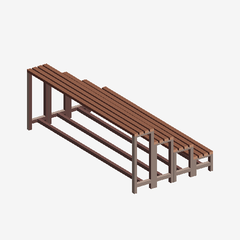 | `prop-bleacher-c` | Bleacher / bench stand (C) | 2.8 x 1.9 x 5.4 | 624 |  |
|  | `prop-bleacher-d` | Bleacher / bench stand (D) | 2.8 x 1.9 x 5.4 | 624 |  |
|  | `prop-floodlight-a` | Floodlight pole | 1.0 x 8.0 x 1.7 | 388 |  |
| 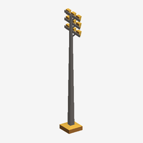 | `prop-floodlight-b` | Floodlight pole | 1.0 x 8.0 x 1.7 | 388 |  |
| 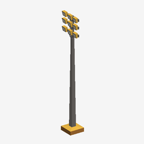 | `prop-floodlight-c` | Floodlight pole | 1.0 x 8.0 x 1.7 | 388 |  |
|  | `prop-floodlight-d` | Floodlight pole | 1.0 x 8.0 x 1.7 | 388 |  |
| 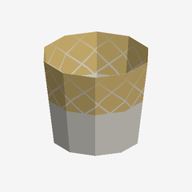 | `prop-planter-a` | Octagonal basket / planter | 0.9 x 0.8 x 1.0 | 80 |  |
| 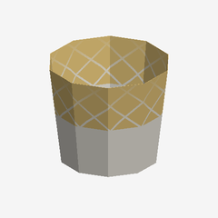 | `prop-planter-b` | Octagonal basket / planter | 0.9 x 0.8 x 1.0 | 80 |  |
|  | `prop-bench-a` | Park bench | 1.5 x 1.6 x 3.3 | 6114 |  |
| 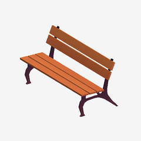 | `prop-bench-b` | Park bench | 1.5 x 1.6 x 3.3 | 6114 |  |
| 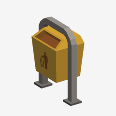 | `prop-bin-yellow` | Street bin, yellow | 0.8 x 1.9 x 1.5 | 164 |  |
|  | `prop-bin-green` | Wheelie bin, green (body + lid) | 1.7 x 2.6 x 1.6 | 630 |  |
|  | `prop-barrier` | Crowd barrier, red | 0.9 x 2.5 x 3.9 | 188 |  |

## Sports court and road (5)

| Preview | ID | Name | W x H x D (u) | Tris | Notes |
|---|---|---|---|---|---|
|  | `court-hoop-a` | Basketball hoop (A) | 2.6 x 5.6 x 3.2 | 904 |  |
|  | `court-hoop-b` | Basketball hoop (B) | 2.6 x 5.6 x 3.2 | 904 |  |
|  | `court-ground` | Basketball court ground | 12.3 x 0.1 x 22.8 | 12 |  |
|  | `court-ground-large` | Large plaza ground plate | 26.0 x 0.1 x 26.0 | 252 |  |
|  | `road-crossing` | Road section with sidewalk ends | 12.5 x 0.1 x 6.8 | 34 |  |

## Trees (2)

| Preview | ID | Name | W x H x D (u) | Tris | Notes |
|---|---|---|---|---|---|
|  | `tree-a` | Low-poly tree in planter (A) | 6.6 x 11.5 x 6.8 | 1143 |  |
|  | `tree-b` | Low-poly tree in planter (B) | 7.8 x 14.0 x 7.7 | 1143 |  |

## Transit (rails, platforms) (9)

| Preview | ID | Name | W x H x D (u) | Tris | Notes |
|---|---|---|---|---|---|
|  | `rail-a` | Track / rail line | 1.4 x 0.9 x 22.4 | 60 |  |
|  | `rail-b` | Track / rail line | 0.5 x 0.4 x 19.7 | 120 |  |
|  | `rail-c` | Track / rail line | 0.5 x 0.4 x 19.7 | 120 |  |
|  | `rail-d` | Track / rail line | 0.5 x 0.4 x 19.7 | 120 |  |
|  | `platform-roof` | Station platform roof | 3.3 x 0.8 x 3.1 | 82 |  |
|  | `platform-ring-a` | Ring platform | 5.7 x 0.2 x 5.6 | 32 |  |
|  | `platform-ring-b` | Ring platform | 5.2 x 0.4 x 5.2 | 44 |  |
|  | `train-car-a` | Train / tube car | 2.7 x 2.6 x 10.7 | 33 |  |
|  | `train-car-b` | Train / tube car | 2.7 x 2.6 x 10.7 | 33 |  |

## Sets (multi-piece) (2)

| Preview | ID | Name | W x H x D (u) | Tris | Notes |
|---|---|---|---|---|---|
|  | `set-music-stage` | Music festival stage (86 pieces: truss, speakers, drums, floor tiles) | 26.7 x 8.8 x 16.5 | 11527 | One scene set; split by node name if needed. |
|  | `set-elevated-road` | Long elevated purple highway with lamps (4 pieces) | 53.9 x 4.3 x 8.5 | 2536 |  |

## Not catalogued

- Background sky sphere (`Sphere`, 60,000 units wide, Background material) and tiny decals (`Circle.002`).
- Many small shop-front parts (awnings, signs, windows, drums) are inside `set-music-stage`; split them by node name if needed.
