# Military vehicles and radars catalog

Documentation only: these GLBs are not copied into the project and nothing in the game uses them yet. Source files are in the Downloads folder.

**License warning:** the three "Strike Fighters" packs (42manako) are **CC-BY-NC-4.0, non-commercial**. Do not ship them in a commercial game. The two standalone radars are CC-BY-4.0.

Sizes: the pack models use roughly 1 unit = 0.1 m (a tank is about 9 m long), so `suggested_scale` 0.1 gives approximate metres; length is along Z. Some heights include antenna/gun parts and look tall, treat them as approximate. Each vehicle has a hull plus separate turret/gun nodes (so the turret can rotate) and `DULL` duplicate meshes.

## Tanks (16)

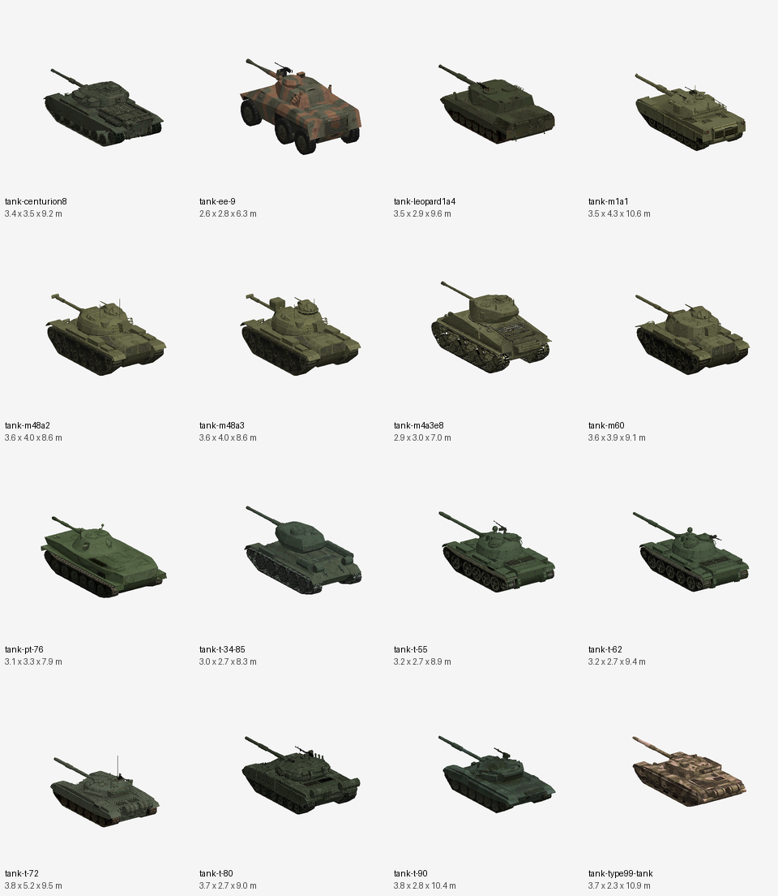

| Preview | ID | Model | W x H x L (m, approx) | Tris | Source | License |
|---|---|---|---|---|---|---|
| 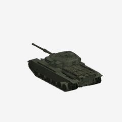 | `tank-centurion8` | Centurion Mk 8 (UK main battle tank) | 3.43 x 3.47 x 9.23 | 5673 | `strike_fighters_tanks_pack.glb` | CC-BY-NC-4.0 |
| 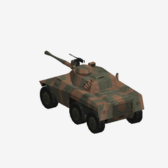 | `tank-ee-9` | EE-9 Cascavel (Brazilian armoured car) | 2.62 x 2.79 x 6.33 | 1563 | `strike_fighters_tanks_pack.glb` | CC-BY-NC-4.0 |
| 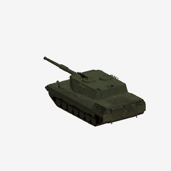 | `tank-leopard1a4` | Leopard 1A4 (West German MBT) | 3.52 x 2.91 x 9.6 | 2307 | `strike_fighters_tanks_pack.glb` | CC-BY-NC-4.0 |
| 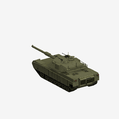 | `tank-m1a1` | M1A1 Abrams (US MBT) | 3.54 x 4.26 x 10.61 | 2181 | `strike_fighters_tanks_pack.glb` | CC-BY-NC-4.0 |
| 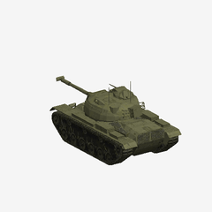 | `tank-m48a2` | M48A2 Patton (US MBT) | 3.57 x 3.96 x 8.56 | 1600 | `strike_fighters_tanks_pack.glb` | CC-BY-NC-4.0 |
| 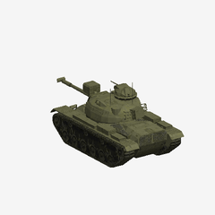 | `tank-m48a3` | M48A3 Patton (US MBT) | 3.57 x 3.96 x 8.56 | 1676 | `strike_fighters_tanks_pack.glb` | CC-BY-NC-4.0 |
| 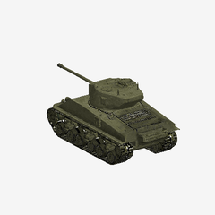 | `tank-m4a3e8` | M4A3E8 Sherman (US WWII medium tank) | 2.93 x 2.97 x 6.95 | 6559 | `strike_fighters_tanks_pack.glb` | CC-BY-NC-4.0 |
| 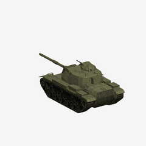 | `tank-m60` | M60 (US MBT) | 3.6 x 3.88 x 9.11 | 1207 | `strike_fighters_tanks_pack.glb` | CC-BY-NC-4.0 |
| 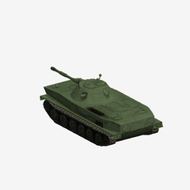 | `tank-pt-76` | PT-76 (Soviet amphibious light tank) | 3.13 x 3.33 x 7.87 | 797 | `strike_fighters_tanks_pack.glb` | CC-BY-NC-4.0 |
| 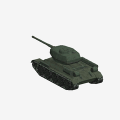 | `tank-t-34-85` | T-34-85 (Soviet WWII medium tank) | 3.01 x 2.71 x 8.29 | 2875 | `strike_fighters_tanks_pack.glb` | CC-BY-NC-4.0 |
|  | `tank-t-55` | T-55 (Soviet MBT) | 3.21 x 2.73 x 8.88 | 1739 | `strike_fighters_tanks_pack.glb` | CC-BY-NC-4.0 |
| 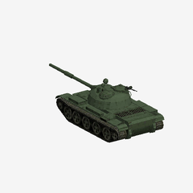 | `tank-t-62` | T-62 (Soviet MBT) | 3.21 x 2.74 x 9.4 | 1950 | `strike_fighters_tanks_pack.glb` | CC-BY-NC-4.0 |
| 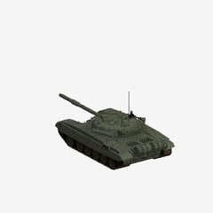 | `tank-t-72` | T-72 (Soviet MBT) | 3.76 x 5.15 x 9.49 | 2578 | `strike_fighters_tanks_pack.glb` | CC-BY-NC-4.0 |
| 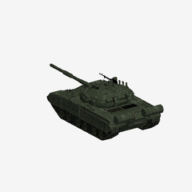 | `tank-t-80` | T-80 (Soviet MBT) | 3.66 x 2.7 x 9.02 | 992 | `strike_fighters_tanks_pack.glb` | CC-BY-NC-4.0 |
| 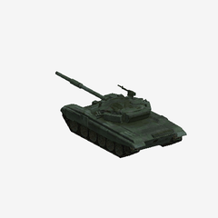 | `tank-t-90` | T-90 (Russian MBT) | 3.79 x 2.76 x 10.39 | 1654 | `strike_fighters_tanks_pack.glb` | CC-BY-NC-4.0 |
| 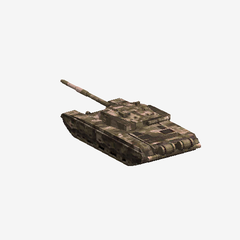 | `tank-type99-tank` | Type 99 (Chinese MBT) | 3.68 x 2.27 x 10.88 | 1624 | `strike_fighters_tanks_pack.glb` | CC-BY-NC-4.0 |

## APC / IFV (12)

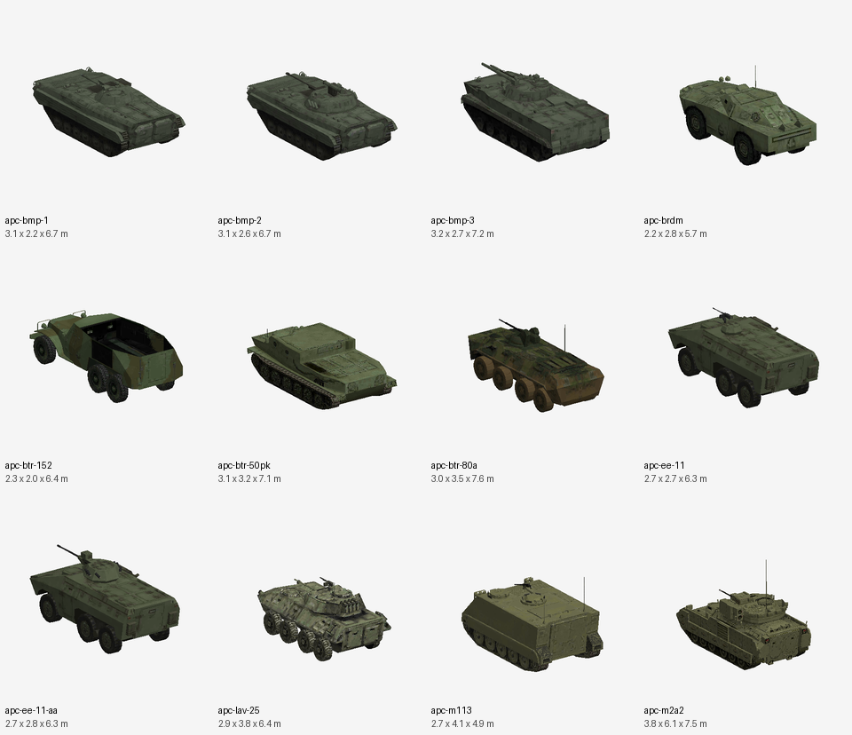

| Preview | ID | Model | W x H x L (m, approx) | Tris | Source | License |
|---|---|---|---|---|---|---|
| 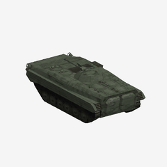 | `apc-bmp-1` | BMP-1 (Soviet IFV) | 3.12 x 2.25 x 6.72 | 1040 | `strike_fighters_apcifv_pack.glb` | CC-BY-NC-4.0 |
| 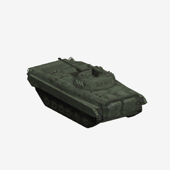 | `apc-bmp-2` | BMP-2 (Soviet IFV) | 3.12 x 2.6 x 6.72 | 1298 | `strike_fighters_apcifv_pack.glb` | CC-BY-NC-4.0 |
| 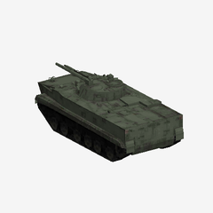 | `apc-bmp-3` | BMP-3 (Russian IFV) | 3.18 x 2.73 x 7.17 | 1450 | `strike_fighters_apcifv_pack.glb` | CC-BY-NC-4.0 |
| 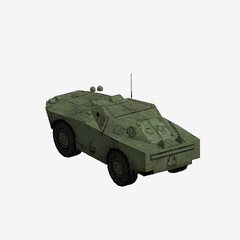 | `apc-brdm` | BRDM-2 (Soviet amphibious scout car) | 2.24 x 2.84 x 5.72 | 616 | `strike_fighters_apcifv_pack.glb` | CC-BY-NC-4.0 |
| 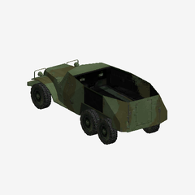 | `apc-btr-152` | BTR-152 (Soviet 6x6 APC) | 2.34 x 2.03 x 6.4 | 896 | `strike_fighters_apcifv_pack.glb` | CC-BY-NC-4.0 |
| 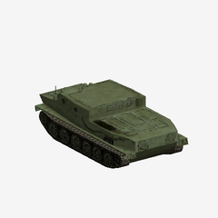 | `apc-btr-50pk` | BTR-50PK (Soviet tracked amphibious APC) | 3.13 x 3.18 x 7.08 | 565 | `strike_fighters_apcifv_pack.glb` | CC-BY-NC-4.0 |
| 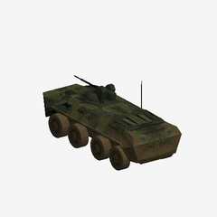 | `apc-btr-80a` | BTR-80A (Soviet 8x8 APC) | 2.99 x 3.55 x 7.62 | 1425 | `strike_fighters_apcifv_pack.glb` | CC-BY-NC-4.0 |
| 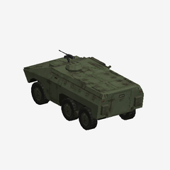 | `apc-ee-11` | EE-11 Urutu (Brazilian 6x6 APC) | 2.7 x 2.68 x 6.3 | 1441 | `strike_fighters_apcifv_pack.glb` | CC-BY-NC-4.0 |
| 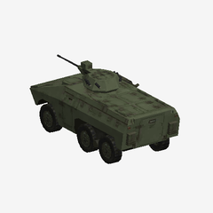 | `apc-ee-11-aa` | EE-11 Urutu anti-aircraft variant | 2.7 x 2.78 x 6.32 | 1608 | `strike_fighters_apcifv_pack.glb` | CC-BY-NC-4.0 |
| 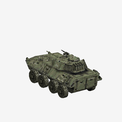 | `apc-lav-25` | LAV-25 (US 8x8 light armoured vehicle) | 2.86 x 3.78 x 6.37 | 3173 | `strike_fighters_apcifv_pack.glb` | CC-BY-NC-4.0 |
| 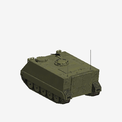 | `apc-m113` | M113 (US tracked APC) | 2.74 x 4.09 x 4.87 | 887 | `strike_fighters_apcifv_pack.glb` | CC-BY-NC-4.0 |
| 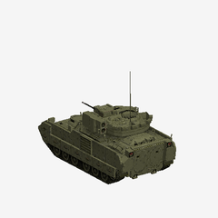 | `apc-m2a2` | M2A2 Bradley (US IFV) | 3.76 x 6.06 x 7.45 | 1875 | `strike_fighters_apcifv_pack.glb` | CC-BY-NC-4.0 |

## Radars (13)

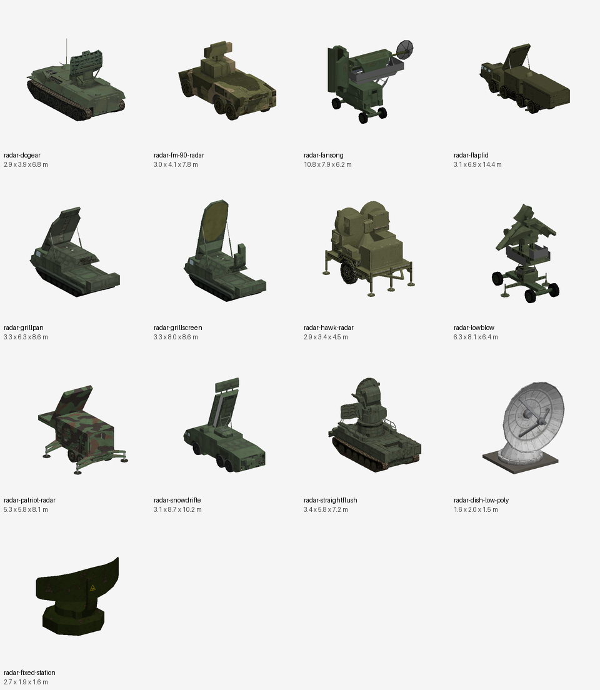

| Preview | ID | Model | W x H x L (m, approx) | Tris | Source | License |
|---|---|---|---|---|---|---|
| 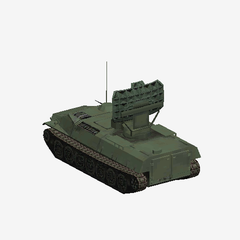 | `radar-dogear` | Dog Ear radar (Soviet, tracked carrier) | 2.86 x 3.88 x 6.83 | 1578 | `strike_fighters_radar_pack.glb` | CC-BY-NC-4.0 |
| 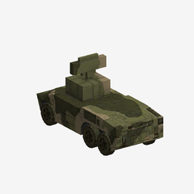 | `radar-fm-90-radar` | FM-90 radar (French Crotale-type) | 2.96 x 4.09 x 7.75 | 596 | `strike_fighters_radar_pack.glb` | CC-BY-NC-4.0 |
| 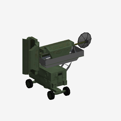 | `radar-fansong` | Fan Song radar (SA-2 guidance) | 10.77 x 7.94 x 6.2 | 1326 | `strike_fighters_radar_pack.glb` | CC-BY-NC-4.0 |
| 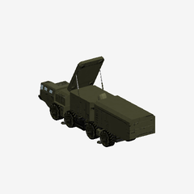 | `radar-flaplid` | Flap Lid radar (SA-10 launcher engagement radar) | 3.06 x 6.86 x 14.38 | 2098 | `strike_fighters_radar_pack.glb` | CC-BY-NC-4.0 |
| 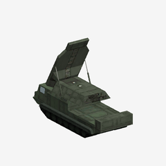 | `radar-grillpan` | Grill Pan radar (Soviet SAM) | 3.29 x 6.29 x 8.57 | 424 | `strike_fighters_radar_pack.glb` | CC-BY-NC-4.0 |
| 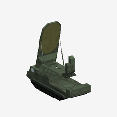 | `radar-grillscreen` | Grill Screen radar (Soviet SAM) | 3.29 x 7.99 x 8.57 | 557 | `strike_fighters_radar_pack.glb` | CC-BY-NC-4.0 |
| 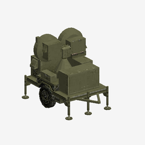 | `radar-hawk-radar` | Hawk radar (US MIM-23 Hawk) | 2.91 x 3.41 x 4.54 | 1478 | `strike_fighters_radar_pack.glb` | CC-BY-NC-4.0 |
| 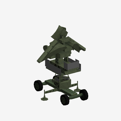 | `radar-lowblow` | Low Blow radar (SA-3 guidance) | 6.28 x 8.11 x 6.39 | 1452 | `strike_fighters_radar_pack.glb` | CC-BY-NC-4.0 |
| 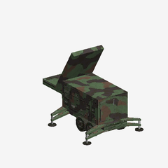 | `radar-patriot-radar` | Patriot radar (US) | 5.32 x 5.85 x 8.05 | 906 | `strike_fighters_radar_pack.glb` | CC-BY-NC-4.0 |
| 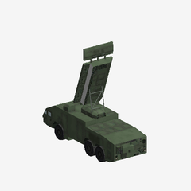 | `radar-snowdrifte` | Snow Drift radar (Soviet, on MZKT chassis) | 3.1 x 8.65 x 10.17 | 1546 | `strike_fighters_radar_pack.glb` | CC-BY-NC-4.0 |
| 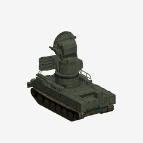 | `radar-straightflush` | Straight Flush radar (SA-6) | 3.37 x 5.81 x 7.15 | 2303 | `strike_fighters_radar_pack.glb` | CC-BY-NC-4.0 |
| 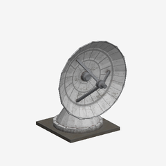 | `radar-dish-low-poly` | Low-poly radar dish | 1.65 x 2.0 x 1.53 | 2514 | `low-poly_radar_dish.glb` | CC-BY-4.0 |
| 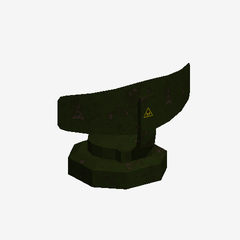 | `radar-fixed-station` | Radar (fixed station, with ground mesh) | 2.66 x 1.86 x 1.64 | 264 | `radar.glb` | CC-BY-4.0 |

## Credits

- Strike Fighters tanks pack by 42manako, CC-BY-NC-4.0, <https://sketchfab.com/3d-models/strike-fighters-tanks-pack-09d9e877167d4124adff9eb7b0410956>
- Strike Fighters APC/IFV pack by 42manako, CC-BY-NC-4.0, <https://sketchfab.com/3d-models/strike-fighters-apcifv-pack-39cf28eb6cb546e49605398ab789b8e8>
- Strike Fighters radar pack by 42manako, CC-BY-NC-4.0, <https://sketchfab.com/3d-models/strike-fighters-radar-pack-26e4fa5a2f354c42a01f9ccf177479b8>
- Low-Poly Radar Dish by joe_carrot, CC-BY-4.0, <https://sketchfab.com/3d-models/low-poly-radar-dish-ed6850e61792430581c8f9851fb7b4c5>
- Radar by Calibians, CC-BY-4.0, <https://sketchfab.com/3d-models/radar-a83d58a8bd6746d692dcf0d444e13b76>

Standalone radars: `radar-dish-low-poly` is about 1.7 x 2 x 1.5 raw (already near metres, small); `radar-fixed-station` is 266 x 185 x 164 raw (about 2.7 x 1.9 x 1.6 m at scale 0.01), includes a ground mesh and an animation.

## Added later: air defence, aircraft, ship (4)

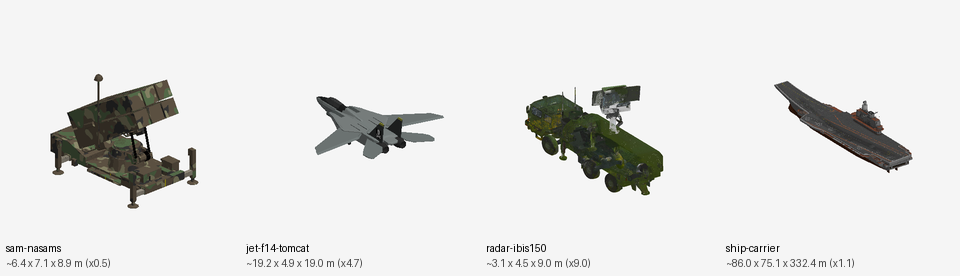

| Preview | ID | Model | Raw size | Scale | ~Size (m) | Tris | License |
|---|---|---|---|---|---|---|---|
| 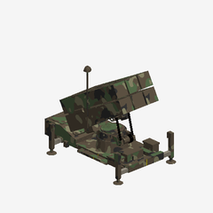 | `sam-nasams` | NASAMS surface-to-air missile launcher | 12.82 x 14.2 x 17.79 | x0.5 | 6.4 x 7.1 x 8.9 | 3114 | CC-BY-4.0 |
| 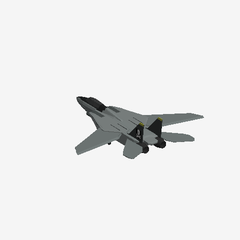 | `jet-f14-tomcat` | F-14 Tomcat (low poly) | 4.08 x 1.04 x 4.04 | x4.7 | 19.2 x 4.9 x 19.0 | 6985 | CC-BY-4.0 |
| 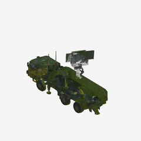 | `radar-ibis150` | IBIS150 air defence radar (very high poly) | 0.35 x 0.5 x 1.0 | x9.0 | 3.1 x 4.5 x 9.0 | 369115 | CC-BY-4.0 |
| 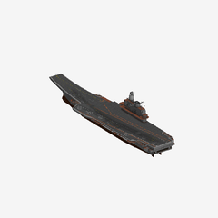 | `ship-carrier` | Aircraft carrier | 78.16 x 68.25 x 302.16 | x1.1 | 86.0 x 75.1 x 332.4 | 1318 | CC-BY-4.0 |

Notes (all four are CC-BY-4.0, so usable commercially with credit; scales are estimates):

- **sam-nasams** - Launcher with raised missile canisters on a camouflage trailer. Single mesh/material. Scale is a guess (a launcher is roughly 8 m long). Source `nasams_1_surface-to-air_missile_system.glb`, "Nasams 1 Surface-to-Air Missile System" by Muhamad Mirza Arrafi, <https://sketchfab.com/3d-models/nasams-1-surface-to-air-missile-system-5fb34fab137c430988fd5642a3b87db3>
- **jet-f14-tomcat** - Has an animation (wing sweep). 81 mesh parts, swept-wing pose in the rest state. Raw length ~4 u is far too small for a jet; x4.7 gives roughly 19 m. Source `low_poly_f14_tomcat.glb`, "Low poly F14 Tomcat" by SIpriv, <https://sketchfab.com/3d-models/low-poly-f14-tomcat-e99d03987b574e80971c1c8cc2b75925>
- **radar-ibis150** - Truck-mounted radar, 4 meshes with one texture material and 369,115 triangles: a scan/AI-generated mesh, far too heavy for a game; decimate it first. Raw size is normalised to about 1 u long, so x9 gives roughly 9 m. Source `ibis150_air_defense_radar.glb`, "IBIS150 air defense radar" by 42manako, <https://sketchfab.com/3d-models/ibis150-air-defense-radar-ffd78c2b016943f7b60252e94d3bc8ad>
- **ship-carrier** - Aircraft carrier hull and island, 4 meshes, 1,318 triangles, light enough to use. Origin is not at the keel centre (bbox y -15..53, z -178..124); x1.1 gives about 330 m. Source `carrier.glb`, "Carrier" by victorberdugo1, <https://sketchfab.com/3d-models/carrier-494f375042bb4133915a51e079557f4b>
