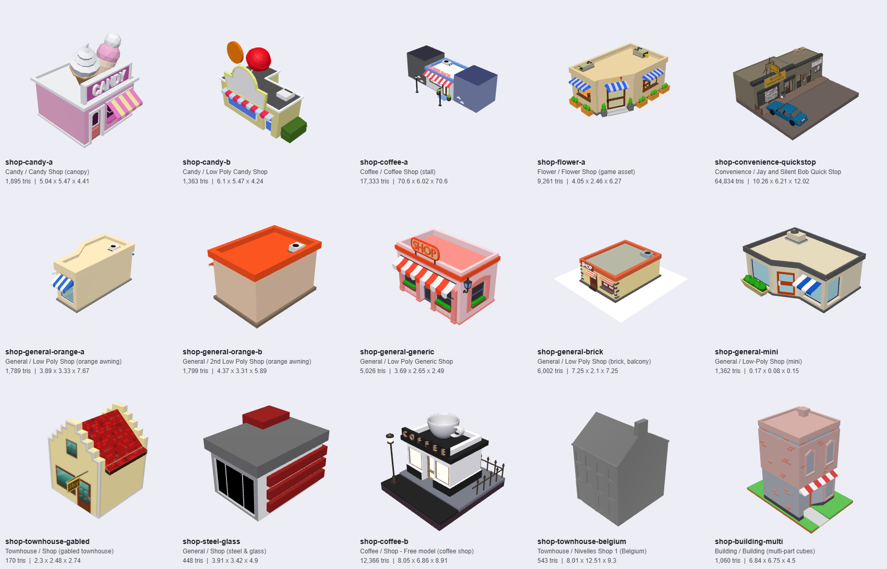

# Shop catalog

13 shops, one of each, in a row on the development island (north-east of the map, `Zone.DEV`),
placed by `scripts/generation/shop_sites.gd` (data: `shops/catalog.json`).

Models face -Z, origin at the centre of the footprint on the ground, 1 unit = 1 m.
Rebuild with `python tools/build_shop_catalog.py <raw dir> shops`. Preview all of them in a row:
`shops/preview/shop_island.tscn` (wheel = zoom, WASD = pan, F = reset).

| ID | Category | Name | W x D x H (m) | Author | License |
|---|---|---|---|---|---|
| `shop-candy-a` | Candy | Candy Shop (canopy) | 4.41 x 5.04 x 5.47 | Ivan Norman | CC-BY-4.0 |
| `shop-candy-b` | Candy | Low Poly Candy Shop | 6.1 x 4.24 x 5.47 | Anggo Ari Wibowo | CC-BY-4.0 |
| `shop-coffee-a` | Coffee | Coffee Shop (stall) | 20.5 x 9.6 x 6.02 | mohdrafey2207 | CC-BY-4.0 |
| `shop-flower-a` | Flower | Flower Shop (game asset) | 6.27 x 4.05 x 2.46 | maloy02 | CC-BY-4.0 |
| `shop-general-orange-a` | General | Low Poly Shop (orange awning) | 7.67 x 3.89 x 3.33 | Virginia Vidonis | CC-BY-4.0 |
| `shop-general-orange-b` | General | 2nd Low Poly Shop (orange awning) | 5.89 x 4.37 x 3.31 | Virginia Vidonis | CC-BY-4.0 |
| `shop-general-generic` | General | Low Poly Generic Shop | 3.69 x 2.48 x 2.64 | assetfactory | SKETCHFAB Standard |
| `shop-general-brick` | General | Low Poly Shop (brick, balcony) | 3.89 x 5.23 x 2.1 | Natisis94 | CC-BY-4.0 |
| `shop-general-mini` | General | Low-Poly Shop (mini) | 4.26 x 3.77 x 1.96 | reginald7 | CC-BY-4.0 |
| `shop-townhouse-gabled` | Townhouse | Shop (gabled townhouse) | 2.3 x 2.74 x 2.48 | linus1178 | CC-BY-4.0 |
| `shop-steel-glass` | General | Shop (steel & glass) | 4.9 x 3.91 x 3.42 | bystryakov.yuriy | CC-BY-4.0 |
| `shop-coffee-b` | Coffee | Shop - Free model (coffee shop) | 8.05 x 8.91 x 6.86 | Astro0960 | CC-BY-4.0 |
| `shop-building-multi` | Building | Building (multi-part cubes) | 4.5 x 6.84 x 6.75 | Codracer13 | CC-BY-4.0 |

## Notes and credits

- **shop-candy-a** - Ice-cream/candy stall with pink & yellow canopy. Source: <https://sketchfab.com/3d-models/candy-shop-51411d40093346b8ac1b6d1224fd8b25>
- **shop-candy-b** - Candy shop with candy_1 prop; origin is off-centre (bbox x -2.3..3.8). Source: <https://sketchfab.com/3d-models/low-poly-candy-shop-d9cd96eb8e2249eea112d7f9b13e3425>
- **shop-coffee-a** - Coffee stall between two dark blocks. The original 70x70 ground plane (mesh Object_20) was removed from this copy; bbox is now 20.5 x 6 x 9.6. Source: <https://sketchfab.com/3d-models/coffee-shop-fa7e884d363847619f89f8ee21fa8742>
- **shop-flower-a** - 255 small meshes (plants/flowers). Contains a Camera node and a pavement mesh. Source: <https://sketchfab.com/3d-models/flower-shop-game-asset-f1eaee257ef5422eb896a08541b4e821>
- **shop-general-orange-a** - Same author/style as shop-general-orange-b. Italian node names. Source: <https://sketchfab.com/3d-models/low-poly-shop-0013cf5979c846449c817a2439fd8705>
- **shop-general-orange-b** - Variant of shop-general-orange-a (adds AC unit, plants, extra awnings). Source: <https://sketchfab.com/3d-models/2nd-low-poly-shop-bc65e31bcdd24d2392e7ea4babebcdc2>
- **shop-general-generic** - Single textured mesh 'ShopBuilding' + a Collider mesh (hide/remove Collider). License is Sketchfab Standard, not CC-BY. Source: <https://sketchfab.com/3d-models/low-poly-generic-shop-58797c167b834d7ab982afa82f693415>
- **shop-general-brick** - Brick shop with balcony on a large white ground plane (remove it); contains Camera, Sun, Plane, Text nodes. Source: <https://sketchfab.com/3d-models/low-poly-shop-0c0665681ce6471c9393795e8a13fa88>
- **shop-general-mini** - Corner shop with blue awning and glass front. Authored tiny: 0.17 units wide, needs ~6x scale-up just to be 1 tile. Source: <https://sketchfab.com/3d-models/low-poly-shop-e41e8060496a4693a9f62f5a4dd5b252>
- **shop-townhouse-gabled** - Step-gabled house with red roof and hanging SHOP sign. 170 tris, single material - cheapest model. Source: <https://sketchfab.com/3d-models/shop-e89a9be0af324355b85278feb4f9da8f>
- **shop-steel-glass** - Grey flat roof, glass front, red louvres/shutters. Pivot is centred vertically (y -1.6..1.8): needs lifting to sit on ground. Source: <https://sketchfab.com/3d-models/shop-23e3cdb766bd40ac9c63fddfd2d39856>
- **shop-coffee-b** - Coffee shop with cup + COFFEE sign on roof, lamp post, fence, on a dark base slab. 12k tris; floats at y 0.68 min. Source: <https://sketchfab.com/3d-models/shop-free-model-a10e5b0977cc41c6b115a568ee18772b>
- **shop-building-multi** - Pink/grey multi-storey building with striped awning and green base. 36 Cube meshes, 19 materials; pivot centred (y -2.85..3.9). Source: <https://sketchfab.com/3d-models/building-6f57edbc41024402ac4035b6b89661e5>
