# Vehicle catalog

73 vehicles. Each is a standalone GLB in `models/<category>/<id>.glb` (front = -Z, Y up, origin on the ground at the centre, approx. metres).
Machine-readable list: [`catalog.json`](catalog.json). Overview image: [`catalog_sheet.png`](catalog_sheet.png).

`id` is the stable key. Names were identified visually, so correct them in `tools/build_vehicle_catalog.py` and re-run.

## Aircraft (3)

| Preview | id | Model | Sub-model | L x W x H (m) | Parts | Tris |
|---|---|---|---|---|---|---|
| 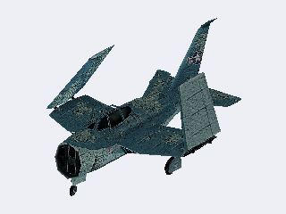 | `p54_47_aircraft_attack` | Attack aircraft | Twin-tail, blue-grey | 11.2 x 7.6 x 4.5 | Body | 757 |
| 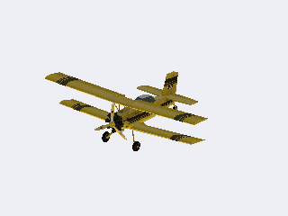 | `p54_45_biplane_yellow` | Biplane | Crop duster, yellow | 8.2 x 12.4 x 3.7 | Body, Glass | 1435 |
| 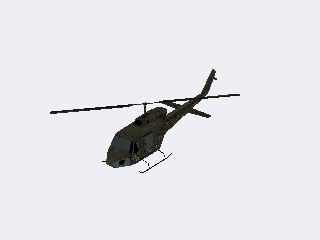 | `p54_46_helicopter_military` | Helicopter | Military, olive | 13.9 x 9.4 x 4.1 | Body, Glass | 625 |

## Buses & RVs (4)

| Preview | id | Model | Sub-model | L x W x H (m) | Parts | Tris |
|---|---|---|---|---|---|---|
| 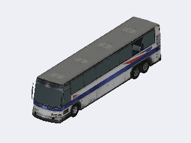 | `p54_32_bus_coach_white` | Coach bus | White/blue stripe | 12.3 x 2.6 x 3.0 | Body, Glass | 1091 |
| 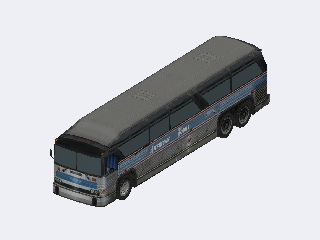 | `p54_34_bus_intercity_dark` | Intercity bus | Dark grey | 11.1 x 2.8 x 2.9 | Body, Glass | 1410 |
| 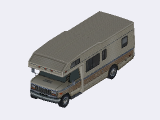 | `p54_31_rv_class_a_beige` | Motorhome | Class A, beige | 7.3 x 3.0 x 2.9 | Body, Glass | 702 |
| 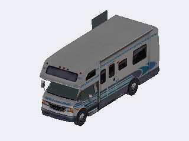 | `p54_36_rv_class_c_white` | Motorhome | Class C, white/blue | 7.0 x 3.5 x 2.9 | Body, Glass | 626 |

## Cars (18)

| Preview | id | Model | Sub-model | L x W x H (m) | Parts | Tris |
|---|---|---|---|---|---|---|
| 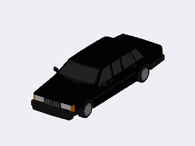 | `m8_long_sedan_black` | Long sedan | Black | 5.4 x 2.1 x 1.4 | Body, Interior, Wheel_FR, Wheel_FL, Wheel_RL, Wheel_RR | 5616 |
| 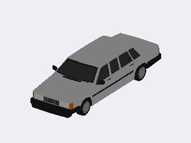 | `m8_long_sedan_silver` | Long sedan | Silver | 5.4 x 2.1 x 1.4 | Body, Interior, Wheel_FR, Wheel_FL, Wheel_RL, Wheel_RR | 5616 |
| 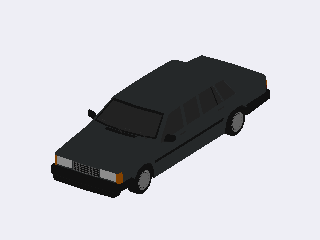 | `m8_long_sedan_charcoal` | Long sedan | Charcoal | 5.4 x 2.1 x 1.4 | Body, Interior, Wheel_FR, Wheel_FL, Wheel_RL, Wheel_RR | 5616 |
| 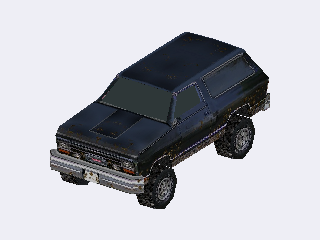 | `p54_01_suv_offroad_navy` | SUV | Off-road 4x4, navy | 4.2 x 2.0 x 1.9 | Body, Glass | 548 |
| 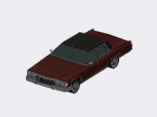 | `p54_03_sedan_classic_maroon` | Sedan | Classic 70s, maroon | 5.1 x 2.2 x 1.4 | Body, Glass | 710 |
| 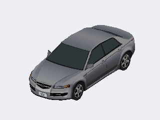 | `p54_04_sedan_modern_silver` | Sedan | Modern, silver | 4.8 x 2.0 x 1.5 | Body, Glass | 719 |
| 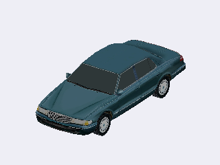 | `p54_05_sedan_90s_teal` | Sedan | 90s, teal | 5.3 x 2.0 x 1.5 | Body, Glass | 801 |
| 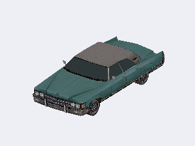 | `p54_24_sedan_hardtop_teal` | Sedan | Classic hardtop, teal | 5.2 x 2.2 x 1.3 | Body, Glass | 678 |
| 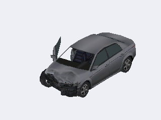 | `p54_30_sedan_modern_damaged_grey` | Sedan | Modern, damaged, grey | 4.8 x 2.8 x 1.6 | Body, Glass | 931 |
| 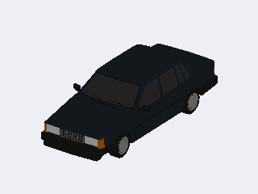 | `m8_sedan_black` | Sedan | Black | 4.8 x 2.1 x 1.4 | Body, Interior, Wheel_FR, Wheel_FL, Wheel_RL, Wheel_RR | 5340 |
| 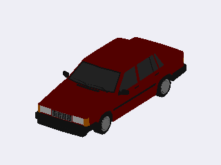 | `m8_sedan_dark_red` | Sedan | Dark red | 4.8 x 2.1 x 1.4 | Body, Interior, Wheel_FR, Wheel_FL, Wheel_RL, Wheel_RR | 5340 |
| 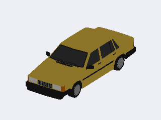 | `m8_sedan_mustard` | Sedan | Mustard | 4.8 x 2.1 x 1.4 | Body, Interior, Wheel_FR, Wheel_FL, Wheel_RL, Wheel_RR | 5340 |
| 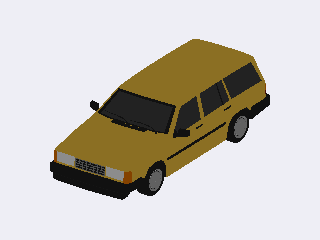 | `m8_wagon_mustard` | Station wagon | Mustard | 4.5 x 2.1 x 1.4 | Body, Interior, Wheel_FR, Wheel_FL, Wheel_RL, Wheel_RR | 5524 |
| 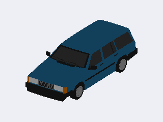 | `m8_wagon_blue` | Station wagon | Blue | 4.5 x 2.1 x 1.4 | Body, Interior, Wheel_FR, Wheel_FL, Wheel_RL, Wheel_RR | 5524 |
| 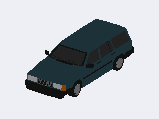 | `m8_wagon_teal` | Station wagon | Teal | 4.5 x 2.1 x 1.4 | Body, Interior, Wheel_FR, Wheel_FL, Wheel_RL, Wheel_RR | 5524 |
| 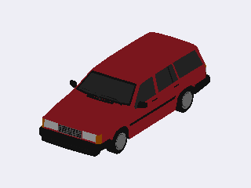 | `m8_wagon_sloped_red` | Wagon, sloped rear | Red | 4.6 x 2.1 x 1.4 | Body, Interior, Wheel_FR, Wheel_FL, Wheel_RL, Wheel_RR | 5698 |
| 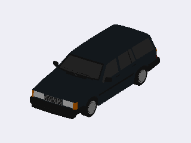 | `m8_wagon_sloped_black` | Wagon, sloped rear | Black | 4.6 x 2.1 x 1.4 | Body, Interior, Wheel_FR, Wheel_FL, Wheel_RL, Wheel_RR | 5698 |
| 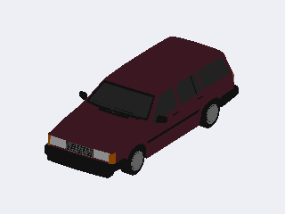 | `m8_wagon_sloped_burgundy` | Wagon, sloped rear | Burgundy | 4.6 x 2.1 x 1.4 | Body, Interior, Wheel_FR, Wheel_FL, Wheel_RL, Wheel_RR | 5698 |

## Construction & Industrial (8)

| Preview | id | Model | Sub-model | L x W x H (m) | Parts | Tris |
|---|---|---|---|---|---|---|
| 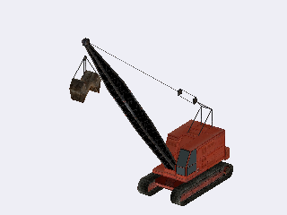 | `p54_40_crane_crawler` | Crawler crane | Dragline, black boom | 18.2 x 4.0 x 17.8 | Body_1, Body_2, Glass | 949 |
| 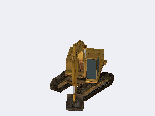 | `p54_17_excavator_yellow` | Excavator | Tracked, yellow | 7.2 x 4.9 x 5.8 | Body, Glass | 862 |
| 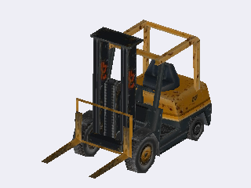 | `p54_39_forklift` | Forklift | Orange/black | 4.1 x 1.6 x 2.9 | Body | 516 |
| 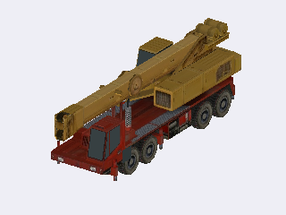 | `p54_35_crane_truck_mobile` | Mobile crane | Truck-mounted, red/yellow | 13.4 x 4.1 x 4.3 | Body, Glass | 1368 |
| 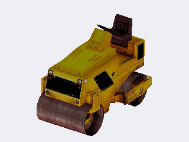 | `p54_53_road_roller_yellow` | Road roller | Yellow | 2.4 x 1.4 x 1.9 | Body | 650 |
| 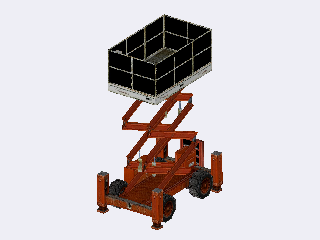 | `p54_54_scissor_lift` | Scissor lift | Orange | 3.2 x 2.1 x 5.0 | Body_1, Body_2 | 563 |
| 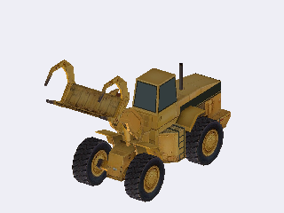 | `p54_38_loader_grapple_yellow` | Wheel loader | Grapple, yellow | 7.6 x 2.5 x 4.8 | Body, Glass | 806 |
| 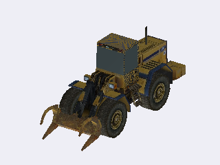 | `p54_41_loader_claw_yellow` | Wheel loader | Claw bucket, yellow | 6.7 x 2.3 x 3.0 | Body, Glass | 1045 |

## Farm & Forestry (3)

| Preview | id | Model | Sub-model | L x W x H (m) | Parts | Tris |
|---|---|---|---|---|---|---|
| 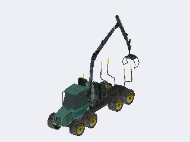 | `p54_42_forwarder_green` | Forwarder | Timber, green | 12.2 x 3.3 x 8.8 | Body, Glass | 1132 |
| 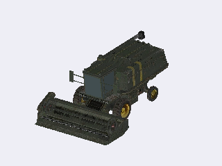 | `p54_21_harvester_olive` | Harvester | Olive green | 10.0 x 6.2 x 3.8 | Body, Glass | 2361 |
| 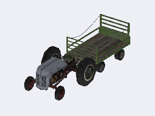 | `p54_43_tractor_vintage_trailer` | Tractor | Vintage with trailer | 9.3 x 3.6 x 2.6 | Body_1, Body_2 | 1761 |

## Military (1)

| Preview | id | Model | Sub-model | L x W x H (m) | Parts | Tris |
|---|---|---|---|---|---|---|
| 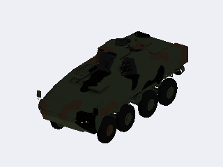 | `rosomak_apc` | Rosomak APC | Old version, camo green | 7.8 x 3.2 x 3.3 | Wheel_R_5, Wheel_R_3, Wheel_R_2, Wheel_R_1, Object_44, Object_46, Wheel_L_5, Wheel_L_3, Wheel_L_2, Wheel_L_1, Object_56, Object_57 | 14194 |

## Motorcycles (2)

| Preview | id | Model | Sub-model | L x W x H (m) | Parts | Tris |
|---|---|---|---|---|---|---|
| 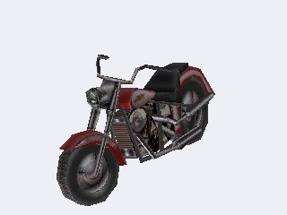 | `p54_22_motorcycle_cruiser_red` | Cruiser | Red | 2.5 x 1.0 x 1.4 | Body | 450 |
| 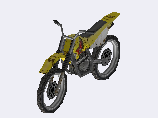 | `p54_28_dirtbike_yellow` | Dirt bike | Yellow | 2.4 x 0.9 x 1.4 | Body | 672 |

## Municipal & Emergency (7)

| Preview | id | Model | Sub-model | L x W x H (m) | Parts | Tris |
|---|---|---|---|---|---|---|
| 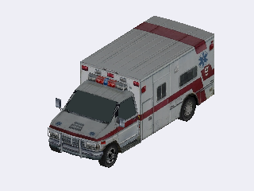 | `p54_11_ambulance` | Ambulance | Box ambulance | 6.6 x 2.8 x 2.6 | Body, Glass | 862 |
| 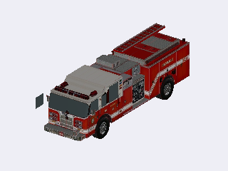 | `p54_33_fire_truck` | Fire truck | Red pumper | 10.7 x 3.6 x 3.2 | Body, Glass | 1019 |
| 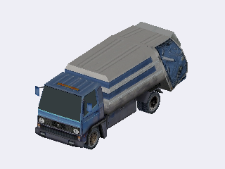 | `p54_06_garbage_truck` | Garbage truck | Rear loader | 8.5 x 3.1 x 3.1 | Body, Glass | 904 |
| 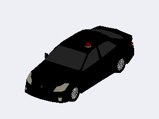 | `police_jp_black` | Police car (JP) | Black, unmarked | 4.8 x 2.0 x 1.6 | Vert_002, Cylinder_005, Wheel_RF, Wheel_RB, Wheel_LF, Wheel_LB, Cube, Vert_003 | 4044 |
| 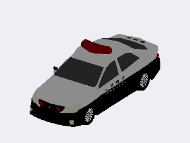 | `police_jp_patrol` | Police car (JP) | Black and white patrol | 4.8 x 2.0 x 1.8 | Vert_001, Vert_005, Wheel_RB, Wheel_RF, Cylinder_007, Wheel_LB, Wheel_LF, Cube_001, Cube_002, Vert | 4402 |
| 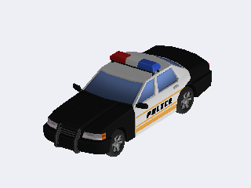 | `police_us_cruiser` | Police car (US) | Black and white | 5.1 x 2.1 x 1.6 | Body | 3942 |
| 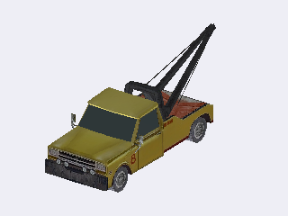 | `p54_08_tow_truck_yellow` | Tow truck | Yellow | 6.4 x 2.4 x 2.5 | Body, Glass | 918 |

## Pickups (5)

| Preview | id | Model | Sub-model | L x W x H (m) | Parts | Tris |
|---|---|---|---|---|---|---|
| 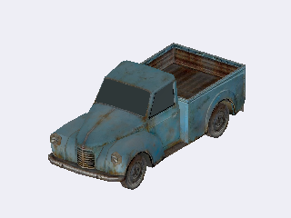 | `p54_25_pickup_vintage_blue` | Pickup | Vintage, blue | 4.8 x 1.9 x 1.9 | Body, Glass | 817 |
| 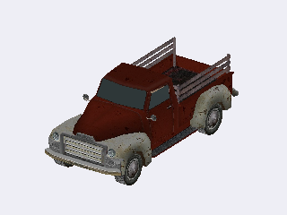 | `p54_26_pickup_40s_red` | Pickup | 1940s style, red | 4.9 x 2.0 x 1.9 | Body, Glass | 2012 |
| 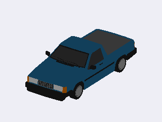 | `m8_pickup_blue` | Pickup | Blue | 4.5 x 2.1 x 1.3 | Body, Interior, Wheel_FR, Wheel_FL, Wheel_RL, Wheel_RR | 5206 |
| 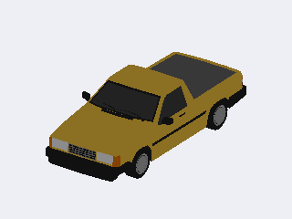 | `m8_pickup_mustard` | Pickup | Mustard | 4.5 x 2.1 x 1.3 | Body, Interior, Wheel_FR, Wheel_FL, Wheel_RL, Wheel_RR | 5206 |
|  | `m8_pickup_olive` | Pickup | Olive | 4.5 x 2.1 x 1.3 | Body, Interior, Wheel_FR, Wheel_FL, Wheel_RL, Wheel_RR | 5206 |

## Semi tractors (5)

| Preview | id | Model | Sub-model | L x W x H (m) | Parts | Tris |
|---|---|---|---|---|---|---|
|  | `p54_20_semi_cabover_yellow` | Cab-over | Yellow/brown | 8.3 x 2.8 x 3.9 | Body, Glass | 1056 |
|  | `p54_29_semi_daycab_red` | Day cab | Red | 8.7 x 2.7 x 3.6 | Body, Glass | 831 |
|  | `p54_14_semi_longnose_red` | Long-nose | Red | 8.9 x 3.0 x 4.2 | Body, Glass | 1052 |
|  | `p54_27_semi_longnose_black` | Long-nose | Black | 7.7 x 3.2 x 3.6 | Body, Glass | 961 |
|  | `p54_19_semi_sleeper_blue` | Sleeper cab | Blue | 9.2 x 2.8 x 4.0 | Body, Glass | 1255 |

## Trailers (5)

| Preview | id | Model | Sub-model | L x W x H (m) | Parts | Tris |
|---|---|---|---|---|---|---|
|  | `p54_50_trailer_box_silver` | Box trailer | Silver | 16.8 x 3.0 x 4.4 | Body | 360 |
|  | `p54_51_trailer_crane` | Crane trailer | Flatbed with crane | 13.2 x 9.8 x 7.6 | Body | 710 |
|  | `p54_48_trailer_flatbed_rust` | Flatbed trailer | Log/stake, rust | 14.2 x 3.4 x 4.1 | Body | 674 |
|  | `p54_52_trailer_semi_brown` | Semi trailer | Box, brown | 12.9 x 3.0 x 4.3 | Body | 636 |
|  | `p54_49_trailer_site_cabin` | Site cabin | Construction office trailer | 8.0 x 3.0 x 3.8 | Body | 288 |

## Trucks (8)

| Preview | id | Model | Sub-model | L x W x H (m) | Parts | Tris |
|---|---|---|---|---|---|---|
|  | `p54_07_box_truck_delivery_yellow` | Box truck | Delivery, yellow | 10.3 x 3.3 x 3.8 | Body, Glass | 953 |
|  | `p54_15_dump_truck_yellow` | Dump truck | 6x4, yellow/grey | 7.1 x 2.7 x 2.9 | Body, Glass | 1159 |
|  | `p54_16_dump_truck_brown` | Dump truck | 6x4, brown | 7.0 x 2.8 x 3.0 | Body, Glass | 799 |
|  | `p54_09_flatbed_crane_orange` | Flatbed truck | With loader crane, orange | 7.1 x 2.7 x 3.6 | Body, Glass | 1145 |
|  | `p54_44_flatbed_boom_orange` | Flatbed truck | With boom, orange | 7.0 x 3.2 x 3.6 | Body, Glass | 834 |
|  | `p54_13_stake_truck_blue` | Stake truck | Open bed, blue | 8.4 x 3.6 x 2.8 | Body, Glass | 888 |
|  | `p54_10_tanker_water` | Tanker | Water tanker | 7.3 x 2.8 x 3.0 | Body, Glass | 1908 |
|  | `p54_18_tanker_fuel` | Tanker | Fuel tanker | 8.0 x 2.2 x 2.9 | Body, Glass | 1798 |

## Vans (1)

| Preview | id | Model | Sub-model | L x W x H (m) | Parts | Tris |
|---|---|---|---|---|---|---|
|  | `p54_02_van_conversion_white` | Van | Conversion van, white | 4.9 x 2.2 x 2.1 | Body, Glass | 584 |

## Wrecks (3)

| Preview | id | Model | Sub-model | L x W x H (m) | Parts | Tris |
|---|---|---|---|---|---|---|
|  | `p54_37_wreck_car_shell` | Car shell | Olive body shell | 5.3 x 2.0 x 1.3 | Body | 678 |
|  | `p54_12_wreck_chassis` | Chassis wreck | Rusted frame | 5.8 x 5.9 x 1.6 | Body_1, Body_2 | 2898 |
|  | `p54_23_wreck_hatchback` | Hatchback wreck | Rusty | 4.2 x 2.0 x 1.3 | Body | 682 |

## Credits

Both packs are licensed **CC BY 4.0**; attribution is required when shipping.

- "Japanese Police Car low poly" by SPixy01 - https://sketchfab.com/3d-models/japanese-police-car-low-poly-07bc7b73bf4541d1bb4683af771bf2f2
- "POLICE CAR - LOW POLY" by Jasmin Daniel - https://sketchfab.com/3d-models/police-car-low-poly-0f5b12ea1f474887b9664fd7a171c17a
- "KTO Rosomak (old version)" by Stachwel - https://sketchfab.com/3d-models/kto-rosomak-old-version-779d15dada5e4b0eb174a98b2ca03fd4
- "54 Vehicle Pack" by PorscheAaron (HotWheelsA) - https://sketchfab.com/3d-models/54-vehicle-pack-10575d5318f244e5987d45239dbc6247
- "Low Poly Vehicle Mini Pack 8" by Vladek - https://sketchfab.com/3d-models/low-poly-vehicle-mini-pack-8-52ee24ff6eb2479891fe68e6ce46af28

Regenerate: `python tools/build_vehicle_catalog.py <54_vehicle_pack.glb> <low_poly_vehicle_mini_pack_8.glb>`
